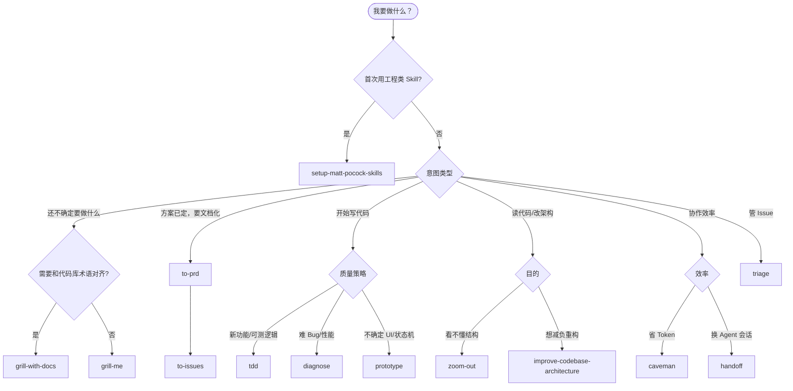

# Matt Pocock Agent Skills 使用指南

本文说明本仓库已安装的 [mattpocock/skills](https://github.com/mattpocock/skills) 各 Skill 的用途、适用场景、调用方式，以及与本货代系统前端（`apps/web-antd`）协作时的推荐工作流。

> **安装位置**
>
> | 类型                 | 路径                                      |
> | :------------------- | :---------------------------------------- |
> | Skill 源码（项目级） | 仓库根目录 `.agents/skills/<skill-name>/` |
> | 版本锁定             | 仓库根目录 `skills-lock.json`             |
> | 上游仓库             | https://github.com/mattpocock/skills      |
> | 官方说明             | https://skills.sh/mattpocock/skills       |

---

## 1. 这些 Skill 解决什么问题？

Matt Pocock 的 Skill 集针对 AI 辅助开发中的四类常见失败模式设计（详见 [官方 README](https://github.com/mattpocock/skills)）：

| 失败模式 | 典型表现 | 对应 Skill 方向 |
| :-- | :-- | :-- |
| 需求没对齐 | 做出来的和想的不一样 | `grill-me`、`grill-with-docs` |
| 沟通冗长、术语混乱 | Agent 用大量废话、和项目黑话不一致 | `caveman`、`grill-with-docs`（维护 `CONTEXT.md`） |
| 代码跑不通 | 缺反馈环、乱改 | `tdd`、`diagnose` |
| 架构变泥球 | 改一处牵一片、难测 | `improve-codebase-architecture`、`zoom-out`、`prototype` |

它们**不是**替代业务文档（`apps/web-antd/doc/modules/`），而是补充「与 Agent 协作时的工程纪律」。

---

## 2. 首次使用：必须先做初始化

在使用 `to-issues`、`to-prd`、`triage`、`diagnose`、`tdd`、`improve-codebase-architecture`、`zoom-out` 等**工程类** Skill 之前，必须先完成仓库级配置。

### 2.1 调用方式

在 Cursor Agent 对话中任选其一：

- 输入斜杠命令：`/setup-matt-pocock-skills`
- 或用自然语言：**「运行 setup-matt-pocock-skills，帮我配置 issue tracker 和领域文档」**

### 2.2 会配置什么？

| 配置项 | 作用 | 生成/更新文件（典型） |
| :-- | :-- | :-- |
| Issue 跟踪器 | `to-issues` / `triage` / `to-prd` 知道往哪写 Issue | `docs/agents/issue-tracker.md` |
| Triage 标签词汇 | `triage` 使用与你仓库一致的标签名 | `docs/agents/triage-labels.md` |
| 领域文档布局 | 其他 Skill 知道去哪读 `CONTEXT.md`、ADR | `docs/agents/domain.md` |
| Agent 入口摘要 | Cursor/Claude 读到的快捷说明 | 根目录 `AGENTS.md` 或 `CLAUDE.md` 中的 `## Agent skills` 段 |

### 2.3 与本项目的建议

| 决策 | 建议 |
| :-- | :-- |
| Issue 跟踪器 | 若使用 GitHub，选 **GitHub**（需本机 `gh` CLI）；纯本地可先用 **Local markdown**（`.scratch/<feature>/`） |
| 领域文档 | 单体前端为主时选 **Single-context**；若前后端/多包各自有术语，再考虑 **Multi-context** + `CONTEXT-MAP.md` |
| `CONTEXT.md` | 建议放在**仓库根目录**，收录货代领域术语（如：委托单、费用锁定、服务项配置），与 `apps/web-antd/doc/modules/` 互补——前者是**术语表**，后者是**页面活文档** |
| ADR | 建议 `docs/adr/`（仓库根），记录跨模块架构决策；页面级细节仍写在 `doc/modules/` |

未完成 setup 时，工程类 Skill 可能创建错误标签、找不到 Issue 接口或误读领域文档路径。

---

## 3. 如何触发 Skill？

Cursor 会根据对话内容**自动匹配** Skill（描述写在各 `SKILL.md` 的 frontmatter 里）。你也可以**显式点名**以提高命中率。

| 方式 | 示例 |
| :-- | :-- |
| 斜杠命令（若 Cursor 已注册） | `/tdd`、`/diagnose`、`/grill-with-docs` |
| 自然语言 | 「用 TDD 红绿重构实现 xxx」「帮我 triage #42」 |
| 关键词 | 「grill me」「caveman mode」「zoom out 这段代码」 |

安装或更新 Skill：

```bash
# 在项目根目录执行
npx skills add mattpocock/skills --agent cursor --all -y   # 安装全部
npx skills add mattpocock/skills --skill tdd diagnose -y # 仅安装部分
npx skills update                                          # 更新
npx skills list                                            # 查看已安装
```

修改 Skill 后建议**新开 Agent 会话**或重载窗口，确保 Cursor 加载最新 `.agents/skills/`。

---

## 4. Skill 总览（14 个）

| Skill | 分类 | 一句话 | 典型触发词 |
| :-- | :-: | :-- | :-- |
| `setup-matt-pocock-skills` | 工程 | 首次配置 issue/标签/领域文档 | setup、初始化 |
| `grill-with-docs` | 工程 | 拷问需求 + 同步 CONTEXT/ADR | 对齐需求、写 ADR |
| `grill-me` | 效率 | 拷问需求（不写文档） | grill me、推敲方案 |
| `to-prd` | 工程 | 从当前对话生成 PRD 并发 Issue | 写 PRD、产品说明 |
| `to-issues` | 工程 | 把计划拆成可独立领取的 Issue | 拆任务、建 ticket |
| `triage` | 工程 | Issue 状态机分流 | triage、看板 |
| `tdd` | 工程 | 红-绿-重构，纵向切片 | TDD、先写测试 |
| `diagnose` | 工程 | 系统化排障 | debug、复现不了 |
| `improve-codebase-architecture` | 工程 | 架构深化与重构建议 | 架构评审、变泥球 |
| `zoom-out` | 工程 | 拉高一层看模块关系 | 看不懂这块代码 |
| `prototype` | 工程 | 可丢弃原型验证设计 | 原型、试 UI |
| `caveman` | 效率 | 极简回复省 Token | caveman、少说点 |
| `handoff` | 效率 | 会话交接文档 | 换会话、交接 |
| `write-a-skill` | 效率 | 编写新 Skill | 写 skill |

---

## 5. 按场景选用（决策树）



---

## 6. 各 Skill 详细说明

### 6.1 `setup-matt-pocock-skills` — 一次性脚手架

**用途：** 让其余工程 Skill 知道本仓库的 Issue 在哪、标签叫什么、`CONTEXT.md` / ADR 在哪。

**适用场景：**

- 刚把 mattpocock/skills 装进本仓库
- 从 GitHub Issue 换成 Linear / 本地 markdown
- Agent 报错「找不到 issue tracker / triage labels」

**不适用：** 日常写业务代码（只跑一次或改配置时重跑）。

**你会得到：** `docs/agents/*.md` + 根目录 Agent 说明块。

---

### 6.2 `grill-with-docs` — 需求拷问 + 领域语言沉淀（推荐）

**用途：** 通过**一次只问一个问题**的方式，把方案里每个分支问清楚；同时对照代码与已有 `CONTEXT.md`，当场更新术语表，必要时写 ADR。

**适用场景：**

- 新模块（如服务项配置、费用审核）开工前
- 业务方描述模糊（「账户」「客户」「委托人」混用）
- 准备大改 `sea-exports` / `fee-management` 等核心域

**与 `grill-me` 的区别：**

|                       | grill-with-docs | grill-me   |
| :-------------------- | :-------------- | :--------- |
| 更新 CONTEXT.md / ADR | ✅              | ❌         |
| 对照代码与术语表      | ✅              | 仅探索代码 |
| 适合长期项目          | ✅ 首选         | 快速脑暴   |

**本仓库示例提示：**

> 我要给「海运出口港口服务项配置」加「按客户类型默认勾选服务项」能力，用 grill-with-docs 帮我对齐需求，并更新 CONTEXT.md 里的术语。

---

### 6.3 `grill-me` — 轻量需求拷问

**用途：** 同样是一次一问，但不维护文档；适合 30 分钟内把方案问透。

**适用场景：** 小改动、 spike、个人想清楚再动手。

---

### 6.4 `to-prd` — 从对话生成 PRD

**用途：** **不再采访你**，直接把当前会话 + 代码理解整理成 PRD，并发布到 Issue 跟踪器（带 `ready-for-agent` 标签）。

**适用场景：**

- 已经和 Agent 聊完方案，缺一份结构化 PRD
- 要把讨论结果交给他人或下一个会话

**前置条件：** 已完成 `setup-matt-pocock-skills`。

**输出结构（摘要）：** Problem Statement、Solution、User Stories（尽量详尽）、Implementation Decisions。

**注意：** 若对话本身模糊，PRD 也会模糊——模糊需求请先 `grill-with-docs`。

---

### 6.5 `to-issues` — 计划拆成纵向切片 Issue

**用途：** 把 PRD/计划拆成 **tracer bullet**（纵向切片）：每个 Issue 贯穿 schema → API → UI → 测试，而不是「先写全部 API 再写全部 UI」。

**适用场景：**

- PRD 已就绪，要排进 Sprint / GitHub Projects
- 大功能要拆给多人或多次 Agent 会话

**流程要点：**

1. 读取已有 PRD 或对话上下文
2. 列出切片（标注 HITL / AFK、依赖关系）
3. **quiz 用户**确认粒度后再创建 Issue

**本仓库示例：**

> 根据 PRD「枚举缓存按需加载」，用 to-issues 拆成 3 个 AFK 纵向切片。

---

### 6.6 `triage` — Issue 分流状态机

**用途：** 按固定角色移动 Issue 标签，并规范 Agent 在 Issue 上的评论格式（含 AI 免责声明）。

**状态角色（默认标签名可自定义）：**

| 状态              | 含义                       |
| :---------------- | :------------------------- |
| `needs-triage`    | 待维护者评估               |
| `needs-info`      | 等报告人补充信息           |
| `ready-for-agent` | 规格完整，可交给 AFK Agent |
| `ready-for-human` | 需人工实现（设计/权限等）  |
| `wontfix`         | 不做                       |

**类别：** `bug` / `enhancement`

**适用场景示例：**

- 「有哪些 Issue 需要我处理？」
- 「把 #128 标成 ready-for-agent」
- 新 Bug 进来，先分类再补 Agent Brief

---

### 6.7 `tdd` — 测试驱动（纵向切片）

**用途：** 强制 **红 → 绿 → 重构**，且**禁止横向切片**（禁止先写 5 个测试再写 5 段实现）。

**哲学要点：**

- 测**行为**（公开接口），不测实现细节
- 优先集成式测试，少 mock 内部 collaborator
- 每个循环只加一个行为

**适用场景：**

- 新建 `src/utils/`、`src/api/` 中可单测的纯逻辑
- 修复有明确行为的 Bug（先写失败测试）
- Composable / 表单校验规则等

**不太适合：**

- 纯样式、布局微调
- 强依赖后端未就绪、又无法 mock 边界的 UI（可先用 `prototype`）

**本仓库示例：**

> 用 TDD 实现 `getEnumItems` 在缓存未命中时的按需加载，先写失败测试再改 `init-enum.ts`。

**延伸阅读（Skill 自带）：** `tests.md`、`mocking.md`、`deep-modules.md`、`interface-design.md`。

---

### 6.8 `diagnose` — disciplined 排障

**用途：** 对「难复现 Bug」「性能回退」走固定阶段，**核心是先建立快速、确定的反馈环**。

**阶段摘要：**

| 阶段 | 做什么 |
| :-- | :-- |
| 1 反馈环 | 失败测试 / curl / Playwright / 最小 harness 等（优先顺序见 Skill） |
| 2 复现 | 确认与用户描述一致 |
| 3 假设 | 3–5 条可证伪假设，**先给用户看** |
| 4 插桩 | 一次只改一个变量 |
| 5 修复 + 回归测试 | 防止复发 |

**适用场景：**

- 列表分页偶发错乱、列配置持久化异常
- 海出委托保存后字段回显不对
- 生产才出现的性能问题

**本仓库示例：**

> 海出列表列配置刷新后偶发丢字段，用 diagnose：先写 Playwright 或 Vitest 复现脚本。

**依赖：** 会读 `CONTEXT.md` 与 `docs/adr/`（需 setup）。

---

### 6.9 `improve-codebase-architecture` — 架构深化评审

**用途：** 扫描代码库，找出「浅模块」、泄漏的 seam、难测区域，输出**临时目录下的 HTML 报告**（含 Mermaid 图），不污染仓库。

**适用场景：**

- 某域（如 `fee-management`、`sea-exports`）改不动了
- 准备大重构前做「加深模块」候选清单
- 希望 Agent 更好导航代码

**术语（Skill 强制使用）：** Module、Interface、Depth、Seam、Adapter、Leverage、Locality。

**建议频率：** 每隔几天或一个大版本前跑一次（官方建议）。

**与本项目：** 可指定「只审 `apps/web-antd/src/views/sea-exports`」。

---

### 6.10 `zoom-out` — 拉高视角看代码

**用途：** 当你不熟悉某目录时，让 Agent **升一层抽象**，用项目术语画出模块与调用关系图。

**适用场景：**

- 第一次改 `except-service`、`payment-application` 子模块
- Code Review 前快速建立 mental model

**特点：** `disable-model-invocation: true`，更适合你**主动发起**，而不是 Agent 随意调用。

**示例：**

> zoom-out：`src/views/client/except-service/` 在整个客户域里处于什么位置？

---

### 6.11 `prototype` — 可丢弃原型

**用途：** 在提交正式实现前，用**明确可删**的代码验证设计。分两支：

| 分支  | 回答的问题              | 产物                              |
| :---- | :---------------------- | :-------------------------------- |
| LOGIC | 状态机/业务规则对不对？ | 终端交互小脚本                    |
| UI    | 长什么样更好？          | 同一路由多版 UI，`?variant=` 切换 |

**规则：** 一键运行、默认无持久化、不写测试、做完记结论再删。

**适用场景：**

- 服务项配置拖拽排序交互不确定
- 工作台卡片布局想试 3 种方案

**本仓库示例：**

> prototype：在 `se-service-config` 旁做 UI 分支，对比「表格内拖拽」和「独立排序面板」。

---

### 6.12 `caveman` — 极简沟通模式

**用途：** 去掉寒暄、冠词、废话，保留技术精度，约省 75% Token。

**触发：** `caveman mode`、`少说点`、`/caveman`

**关闭：** `stop caveman` 或 `normal mode`

**适用：** 你已熟悉上下文，只要结论和补丁。

**不适用：** 安全警告、不可逆操作确认、多步操作易误解时（Skill 会自动恢复完整句式）。

---

### 6.13 `handoff` — 会话交接

**用途：** 把当前会话压成交接文档，给**下一个 Agent 会话**继续用；保存到系统临时目录（不进 Git）。

**适用场景：**

- 上下文快满、要开新 Chat
- 要把未完成工作交给同事或其他模型

**应包含：** 进度、阻塞、相关文件路径、**建议下一步用的 Skill**。

**不要重复：** 已有 PRD、ADR、Issue 全文——只引用路径。

---

### 6.14 `write-a-skill` — 编写自定义 Skill

**用途：** 按渐进披露原则写新 Skill（如本仓库的 `auto-doc-sync`）。

**适用场景：**

- 想把「Swagger 对齐检查」「枚举接入检查」固化成团队 Skill

---

## 7. 推荐工作流（与本货代前端结合）

### 7.1 新功能（中大型）

```text
setup（首次）
  → grill-with-docs（对齐 + CONTEXT.md）
  → to-prd（出 PRD Issue）
  → to-issues（纵向切片 Issue）
  → triage（标 ready-for-agent / ready-for-human）
  → tdd 或 prototype（视 UI/逻辑而定）
  → auto-doc-sync / 手动更新 doc/modules（业务活文档）
```

### 7.2 Bug 修复

```text
diagnose（建立复现环 → 假设 → 修复）
  → tdd（补回归测试，若适合）
  → 更新 doc/changelogs + 相关 modules 文档
```

### 7.3 读代码 / 小改

```text
zoom-out（不熟时）
  → 直接改代码
  → caveman（只要结论时）
```

### 7.4 文档体系分工

| 文档类型 | 路径 | 维护方式 |
| :-- | :-- | :-- |
| 领域术语表 | 根目录 `CONTEXT.md` | `grill-with-docs`、人工 |
| 架构决策 | `docs/adr/` | `grill-with-docs` |
| 页面业务活文档 | `apps/web-antd/doc/modules/` | 开发完成 + `auto-doc-sync` |
| 开发指南 | `apps/web-antd/doc/guides/` | 人工 / 本文 |
| 变更记录 | `apps/web-antd/doc/changelogs/` | `auto-doc-sync` |

---

## 8. 常见问题

### Q1：Skill 没生效？

1. 确认 `.agents/skills/<name>/SKILL.md` 存在
2. 新开 Agent 会话
3. 对话里**显式写出** Skill 名或触发词

### Q2：和项目自带 `auto-doc-sync` 冲突吗？

不冲突。`auto-doc-sync` 管**中文业务活文档与 changelog**；mattpocock Skill 管**需求对齐、Issue、TDD、排障、架构**。大功能可：`grill-with-docs` → 开发 → `auto-doc-sync` 沉淀。

### Q3：只想装几个 Skill？

```bash
npx skills add mattpocock/skills --skill tdd diagnose grill-with-docs -y
```

### Q4：如何更新到上游最新版？

```bash
npx skills update
```

### Q5：工程 Skill 报错找不到 issue tracker？

先运行 `/setup-matt-pocock-skills`，或检查 `docs/agents/issue-tracker.md` 是否存在。

---

## 9. 快速参考卡片

| 我想…              | 用这个                          |
| :----------------- | :------------------------------ |
| 第一次装完 Skill   | `setup-matt-pocock-skills`      |
| 大需求开工前问清楚 | `grill-with-docs`               |
| 快速问方案不写文档 | `grill-me`                      |
| 把讨论变成 PRD     | `to-prd`                        |
| PRD 拆任务         | `to-issues`                     |
| 整理 GitHub Issue  | `triage`                        |
| 先写测试再写实现   | `tdd`                           |
| 难 Bug / 性能问题  | `diagnose`                      |
| 代码变泥、想重构   | `improve-codebase-architecture` |
| 看不懂某目录       | `zoom-out`                      |
| 试 UI 或状态机     | `prototype`                     |
| 回复要极短         | `caveman`                       |
| 换聊天继续干       | `handoff`                       |
| 写团队自己的 Skill | `write-a-skill`                 |

---

## 10. 相关链接

- 上游仓库：[mattpocock/skills](https://github.com/mattpocock/skills)
- Skills 市场：[skills.sh/mattpocock/skills](https://skills.sh/mattpocock/skills)
- 本仓库 Skill 目录：`.agents/skills/`
- 姊妹指南：[枚举在业务页面中的使用指南](./enumeration-usage-in-pages.md)
