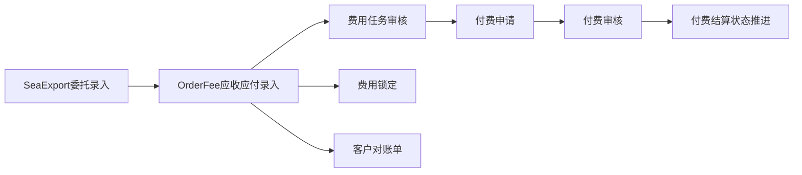

# FreightBusiness 总览文档

## 1. 文档目标与范围

- 目标：给产品、测试提供货代系统 Web 端主流程的统一业务视图，支撑主流程测试设计。
- 范围：`apps/web-antd` 中海运出口、费用录入、费用审核、费用锁定、付费申请、付费审核、客户对账相关模块。
- 主流程（当前约定）：海运出口委托 -> 录入费用 -> 付费申请 -> 付费结算。

## 2. 模块入口与路由

### 2.1 海运出口

- 路由：`/sea-exports`、`/sea-exports/create`、`/sea-exports/:id/edit`
- 代码：`apps/web-antd/src/router/routes/modules/sea-export.ts`
- 页面：`apps/web-antd/src/views/sea-export-admin/`

### 2.2 费用管理

- 路由：`/fee-management/fee-lock`、`/fee-management/payment-application`、`/fee-management/statement`
- 权限：`Admin.OrderFee.Lock`、`Admin.PaymentApplication`、`Admin.Statement`
- 代码：`apps/web-antd/src/router/routes/modules/fee-management.ts`

### 2.3 审核审批

- 路由：`/audit-approval/expense-review`、`/audit-approval/payment-review`
- 权限：`Admin.OrderFee.Audit`、`Admin.PaymentApplication.Audit`
- 代码：`apps/web-antd/src/router/routes/modules/audit-approval.ts`

## 3. 端到端业务链路

## 4. 核心业务对象

- 委托单（海运出口）：`SeaExportDto + transportOrder`
- 费用（订单费用）：`OrderFeeDto`
- 费用审核任务：`OrderFeeTask*`（提交/修改/删除）
- 付费申请单：`PaymentApplicationDto`
- 付费审核任务：`PayAppTaskItemDto`
- 对账单：`StatementDto`

## 5. 主流程说明（产品/测试视角）

### 5.1 海运出口委托录入

- 用户在海运出口列表新建委托并保存，系统生成业务主键，进入编辑态。
- 编辑页作为业务中台，承载基础信息、更改单、应收应付、派车、分单等子模块入口。

### 5.2 费用录入

- 在委托编辑页「应收应付」维护费用明细，核心字段包括收付类型、费用代码、结算对象、币别、汇率、金额、税率、状态。
- 费用可经历录入、提交审核、审核结果、结算推进等状态变化。

### 5.3 费用审核与锁费

- 费用审核用于控制费用提交、修改、删除动作的审批闭环。
- 费用锁定用于批量冻结费用可编辑性，避免结算阶段被非预期改动。

### 5.4 付费申请

- 财务或业务角色基于已录入费用选择可申请项，生成付费申请单。
- 申请单支持按原票币或指定结算币别，维护申请金额、汇率、附言与附件。

### 5.5 付费审核与结算推进

- 审核角色在付费审核列表执行通过/驳回，驱动申请单状态推进。
- 费用与申请单会出现部分结算、结算完毕等状态，用于反映实际结算进度。

### 5.6 对账单（补充链路）

- 对账单与费用数据相关联，侧重客户账单维度汇总，不等同于付费申请审核流程。

## 6. 角色与分工建议

- 业务操作：委托录入、费用录入、提交审核。
- 财务操作：付费申请、对账单维护、结算执行。
- 审核角色：费用审核、付费审核（工作流节点执行）。
- 测试关注：跨模块状态一致性、金额口径一致性、权限隔离与可见性。

## 7. 测试主路径（建议）

1. 新建海运出口委托并进入编辑页。
2. 录入多条应收/应付费用，覆盖多币别、不同结算对象。
3. 发起费用相关审核动作并完成审核。
4. 在付费申请中选取费用，提交申请并完成付费审核。
5. 校验费用结算相关字段与申请单状态是否联动。
6. 补充验证对账单添加费用与移除费用的口径一致性。

## 8. 当前实现边界与注意事项

- 海运出口编辑页顶部 Tab 中部分标签（如“服务详情”“单证信息”“问题记录”“修改历史”）当前仅显示标签，未见对应内容挂载；测试时应以已挂载子模块为准。
- “结算”在系统中存在多层语义：费用结算状态、付费申请状态、客户对账单维度，需要在需求与测试用例中明确口径。
- 本文档仅基于前端代码可见逻辑，后端计算公式与最终财务记账规则需另行对齐。
