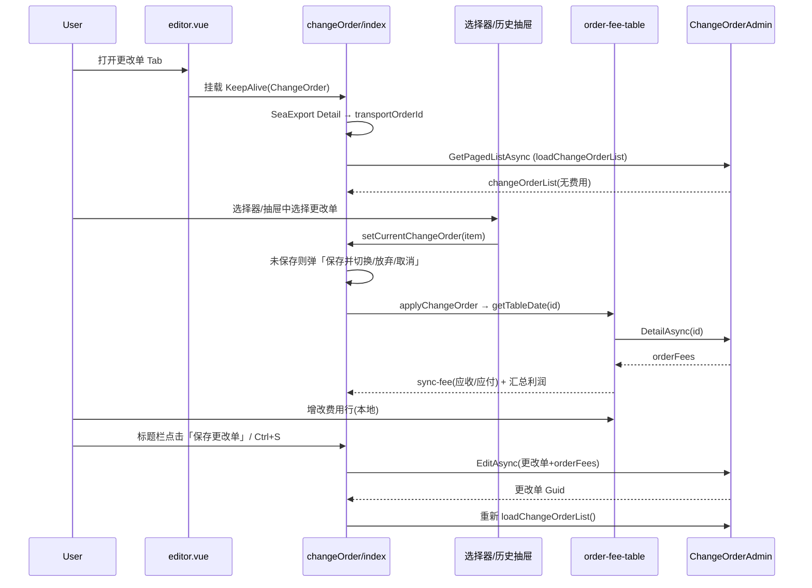

# 1. 业务背景说明 (Background)

**白话解释：** 更改单是挂在运输单（`transportOrder`）下的「费用变更容器」。当主单费用已进入财务管控（尤其是费用锁定）后，业务侧不宜再直接改主单费用，而是新建更改单：写明会计期间与更改原因，在更改单下录入应收/应付费用，再走提交审核、结算等后续链路。主单费用与更改单费用互相独立；更改单自身也可单独费用锁定。

**入口与源码定位：**

| 项目 | 内容 |
| :-- | :-- |
| 海出入口 | `/sea-exports/:id/edit` → Tab「更改单」（内部 key=`party`） |
| 海引进口 | `/sea-imports/:id/edit` → Tab「更改单」 |
| 海出页面 | `src/views/sea-export-admin/changeOrder/index.vue` + `table.vue` |
| 海进页面 | `src/views/sea-import-admin/changeOrder/index.vue` + `table.vue` |
| 费用表（复用） | `orderFee/modules/order-fee-table.vue`，`mode='changeOrder'` |
| API | `/services/app/ChangeOrderAdmin`（海出/海进各一份封装，路径相同） |
| 锁费入口 | `/settlement-management/fee-lock`（树形：主单 + 子级更改单） |

**与主单费用的边界：**

| 维度 | 主单费用（应收应付 Tab） | 更改单费用 |
| :-- | :-- | :-- |
| 归属 | `changeOrderId` 为空 | 归属某条更改单 |
| 会计期间 | 业务 `accountDate` | 更改单 `accountDate` |
| 保存入口 | 费用表自身「保存」→ `OrderFeeAdmin` | 更改单表「保存」→ `ChangeOrderAdmin/EditAsync`（带 `orderFees`） |
| 费用锁定 | 锁运输单 | 锁更改单（传 `changeOrderId`） |
| 未完结限制 | 主单锁费受 `isUnfinished` 拦截 | 更改单锁费**不受** `isUnfinished` 影响 |
| 列表费用状态聚合 | 海出列表 `receiveFeeStatus` / `payFeeStatus` **含**更改单费用 | 同左 |
| 批量引入源 | 仅主单费用（不含更改单） | 目标可指定 `changeOrderId`（当前 UI「暂不支持」） |

---

# 2. 功能与操作说明 (Features & Operations)

## 2.1 页面结构

```
更改单 Tab
├── 顶部通铺：订单信息浅底通栏（默认关键字段一行折叠，点击展开；无本页配置入口，字段显隐仍读 `order_fee_display_config`）
└── 更改单编辑区
    ├── 标题栏：当前更改单选择器 + 状态标签 + 新建（非草稿时）/ 保存
    ├── 基本信息：会计期间 / 更改原因 / 备注
    ├── 费用表（mode=changeOrder）
    │   ├── 工具栏左侧：应收 / 应付分段切换（含条数 Badge）
    │   └── 工具栏右侧：新增 / 打印 / 删除等
    └── 底部利润汇总：应收 / 应付 / 利润 / 利润率（+ 原币分币种）
```

选择器下拉与右侧「历史更改单」抽屉共用 `changeOrderList`；草稿态（无服务端 id）隐藏「新建」。

## 2.2 更改单 CRUD

| 操作 | 用户动作 | 前端行为 | 后端接口 |
| :-- | :-- | :-- | :-- |
| 列表加载 | 进入 Tab | `GetPagedListAsync`（分页，**不含费用**）→ `changeOrderList` | `GET .../GetPagedListAsync` |
| 新建 | 点「新建」（草稿态隐藏） | 本地进入草稿，默认 `accountDate=当前年月`，无服务端 id | — |
| 选中 | 选择器 / 历史抽屉 | `setCurrentChangeOrder` → 加载该更改单下应收/应付费用 | `GET .../DetailAsync?id=` |
| 保存 | 点标题栏「保存更改单」或 `Ctrl/Cmd+S` | 组装当前更改单 + 两侧费用表数据，`EditAsync` | `PUT .../EditAsync` |

**保存载荷要点（`ChangeOrderEditDto`）：**

- `id`：已有更改单 id；新建行首次保存时前端可能尚未带服务端 id（依赖后端按无 id 视为新增）
- `transportOrderId`：当前票的运输单 id（来自海出/海进详情 `detail.transportOrder.id`，**不是**路由上的海出/海进 id）
- `accountDate`：会计期间（前端展示/编辑为 `YYYY-MM`）
- `reason` / `remark`：更改原因、备注（表格内可编辑）
- `orderFees`：当前应收表 + 应付表全部行；每行补 `changeOrderId`、`paySide`（0 应收 / 1 应付）

返回值为新建/更新后的更改单 `Guid`。

## 2.3 更改单下的费用操作

费用表复用主单组件，通过 `mode='changeOrder'` 切换行为：

| 能力 | 更改单模式表现 |
| :-- | :-- |
| 加载数据 | 不走 `OrderFee` 分页；调 `ChangeOrderAdmin/DetailAsync`，按 `paySide` 过滤 |
| 费用表「保存」按钮 | **隐藏**；费用随更改单 `EditAsync` 一并提交 |
| 删除费用行 | **仅本地移除**，不立刻调 `batchDeleteOrderFee`；真正落库靠下次更改单保存（或需与后端约定删除语义） |
| 打印 | 支持；`isChangeOrderPrint=true` + `detailInput={ id: 更改单id, ids?: 勾选费用 }` |
| 收付互生 | 仍可用；入参可带 `changeOrderId`（见卡点：当前父组件未传 `parentChangeOrderId`） |
| 批量引入 | UI 仍展示，但弹窗内 `changeOrderId: undefined`，**暂不支持引入到更改单** |
| 提交审核 / 申请修改删除 / 撤回 | 与主单费用相同，走费用审核任务链路 |

## 2.4 费用锁定（财务侧）

- 财务在「费用锁定」页看到树形结构：父行=运输单，子行=该单下更改单。
- 锁定/解锁入参：`{ transportOrderId, changeOrderId? }`；不传 `changeOrderId` 锁主单，传入则锁对应更改单。
- 更改单行展示：会计期间、原因、锁费状态/时间等。
- 业务未完结（`isUnfinished=true`）时禁止锁**主单**费用；锁**更改单**不受此限制。

## 2.5 打印

- 应收 `PrintJsonType=1000`，应付 `1500`。
- 后端 `PrintFormatAdmin/GetPrintAsync`：`isChangeOrderPrint=true` 时按更改单详情取费用。
- 勾选已保存费用则传 `detailInput.ids`，未勾选则打印该更改单下该收付方向全部费用。

---

# 3. 状态流转说明 (Status Transitions)

| 当前状态 | 触发人/动作 | 目标状态 | 状态说明 |
| :-- | :-- | :-- | :-- |
| 主单费用可编辑 | 财务锁主单费用 | 主单费用锁定 | 主单费用不可再直接变更；后续增量费用应落在更改单 |
| 无更改单 | 用户新建 + 保存 | 更改单已创建 | 生成更改单记录，可带初始费用 |
| 更改单未选中 | 双击更改单行 | 费用明细加载 | `DetailAsync` 拉取该单 `orderFees`，分应收/应付展示 |
| 更改单费用录入中 | 费用行编辑 + 更改单「保存」 | 费用随更改单落库 | 费用 `changeOrderId` 指向当前更改单；`accountDate` 取更改单期间 |
| 更改单费用录入/驳回 | 提交审核 | 进入费用审核 | 与主单费用共用审核任务类型 |
| 更改单费用审核通过 | 开票/付款/对账/结算 | 结算进度推进 | 结算状态仍体现在费用行；列表组合费用状态含更改单 |
| 更改单未锁定 | 财务锁更改单 | 更改单费用锁定 | 后续对该更改单的增删改受锁费校验拦截 |
| 更改单已锁定 | 财务解锁 | 更改单可再编辑 | 记录解锁人/时间 |
| 任意 | 删除更改单 | 更改单软删/移除 | 需无业务冲突（以后端校验为准） |

---

# 4. 核心字段说明 (Field Definitions)

| 字段名 | 📖 字段含义说明 | 🔌 数据来源 (接口/字典) | 🔗 联动规则 (依赖与触发) | 🛡️ 校验限制 (Validation) |
| :-- | :-- | :-- | :-- | :-- |
| **transportOrderId** | 所属运输单（业务）主键 | 海出/海进 `DetailAsync` → `transportOrder.id` | **触发/依赖：** 列表筛选、保存、锁费、收付互生均依赖此 id | 必须与当前票一致；勿与路由海出/海进 id 混用 |
| **id（更改单）** | 更改单主键 | `ChangeOrderAdmin` | **触发/依赖：** 详情、删除、打印、锁费子行 | 新建本地行无服务端 id，保存后由后端返回 |
| **accountDate** | 会计期间（按月） | DTO；后端说明：有开船日按开船月，否则按创建日 | **触发/依赖：** 更改单费用的 `AccountDate` 取更改单期间 | 前端表格默认当前 `YYYY-MM` |
| **reason** | 更改原因 | 表格可编辑 | 锁费列表子行展示 | 关键字搜索可模糊匹配原因/备注 |
| **remark** | 备注 | 表格可编辑 | — | 可空 |
| **feeLocked** | 更改单是否费用锁定 | `ChangeOrderDto` / 锁费接口 | **触发/依赖：** 费用增删改、批量引入等会做锁费校验 | 锁定后不可操作该更改单费用 |
| **feeLockedUserName / feeLockedTime** | 锁费人、时间 | 详情/列表 | 只读展示 | — |
| **feeUnLockedUserName / feeUnLockedTime** | 解锁人、时间 | 详情/列表 | 只读展示 | — |
| **orderFees** | 更改单下费用集合 | 仅详情接口返回；列表接口不含 | 按 `paySide` 拆到应收/应付两表 | 保存时整包回传 |
| **changeOrderId（费用行）** | 费用归属更改单 | `OrderFeeEditDto` | 保存时前端强制写入当前更改单 id | 为空则为主单费用 |
| **sortId** | 排序 | DTO | — | 可选 |

---

# 5. 核心业务卡点 (Business Blockers)

> [!IMPORTANT] **[卡点 1：三个 ID 不能混用]**
>
> - 路由 `:id` = 海出/海进主记录 id
> - `transportOrderId` = 运输单 id（更改单、费用、锁费）
> - `changeOrderId` = 更改单 id（详情、打印、锁子行）  
>   混用会导致列表为空、保存错票或打印失败。

> [!IMPORTANT] **[卡点 2：主单锁费 ≠ 更改单锁费]** 主单锁定后，更改单仍可新建并录费用（业务上用于锁费后的变更）。但若**该更改单自身**已锁定，则对该更改单的费用操作会被后端拒绝（如「更改单已费用锁定不可操作」）。

> [!IMPORTANT] **[卡点 3：费用保存路径不同]** 更改单模式下费用表隐藏「保存」；只点费用表操作不会把费用持久化到更改单。必须点更改单工具栏「保存」，走 `EditAsync` 整包提交。

> [!NOTE] **[卡点 4：列表查询应带 TransportOrderId]（海出已修复 2026-07-21）** 海出 `changeOrder/table.vue` 的 `GetPagedList` 已补传 `TransportOrderId`，父组件监听 `transportOrderId` 就绪后加载列表。海进 `sea-import-admin` 同名页仍待同步。

> [!NOTE] **[卡点 5：收付互生的 changeOrderId]（海出已修复 2026-07-21）** 海出更改单页已向应收/应付费用表透传 `:parent-change-order-id="changeOrder?.id"`，收付互生可正确带上更改单 id。海进侧仍待同步，且后端落库语义建议联调确认。

> [!WARNING] **[卡点 6：批量引入暂不支持更改单]** `batch-import-fee-modal` 固定 `changeOrderId: undefined`；后端接口本身支持目标更改单。

> [!NOTE] **[卡点 7：显示配置共享]** 顶部订单信息仍读取 `localStorage` key `order_fee_display_config`，但更改单页**无配置入口**；改字段显隐请到应收应付页操作。

---

# 6. 接口速查

| 接口 | 方法 | 说明 |
| :-- | :-- | :-- |
| `/services/app/ChangeOrderAdmin/GetPagedListAsync` | GET | 更改单列表（无费用）；可筛 `TransportOrderId` / `FeeLocked` / `Keyword` |
| `/services/app/ChangeOrderAdmin/DetailAsync` | GET | 更改单详情（带费用）；打印取数亦走此逻辑 |
| `/services/app/ChangeOrderAdmin/EditAsync` | PUT | 新增或编辑更改单并带费用；返回 Guid |
| `/services/app/ChangeOrderAdmin/DeleteAsync` | DELETE | Body `GuidIdDto.ids` 批量删除 |
| `/services/app/TransportOrderAdmin/FeeLockAsync` | PUT | `items[{ transportOrderId, changeOrderId? }]` |
| `/services/app/TransportOrderAdmin/FeeUnLockAsync` | PUT | 同上，解锁 |
| `/services/app/OrderFeeAdmin/GenerateOppositeOrderFees*` | POST | 收付互生，可选 `changeOrderId` |
| `/services/app/OrderFeeAdmin/ImportOrderFeesToTransportOrderAsync` | POST | 批量引入，可选目标 `changeOrderId` |
| `/services/app/PrintFormatAdmin/GetPrintAsync` | — | `isChangeOrderPrint` + `detailInput` |

---

# 7. 前端关键时序（海出）



---

# 8. 变更与解析日志 (Changelog & Insights)

| 日期 | 变更类型 | 📝 业务功能变动 (针对工作流A) | 🤖 代码解析与架构洞察 (针对工作流B) |
| :-- | :-- | :-- | :-- | --- |
| 2026-07-21 | `Fix` | 去掉编辑区冗余「更改单」标题；更改单费用表禁用列排序；表格左右与顶部表单统一 16px 对齐。详见 `changelogs/change-log-2026-07-21-change-order-align-nosort.md`。 | `mode=changeOrder` 关 `sortConfig` 并清列 `sortable`；去掉表内 `px-1`。 |
| 2026-07-21 | `Feature` | 订单信息条样式精简：去右上角配置齿轮与配置弹窗；折叠为单行通栏摘要（竖线分隔、超长省略）。详见 `changelogs/change-log-2026-07-21-change-order-info-bar-style.md`。 | 仍只读 `useDisplayFieldConfig`；配置入口仅在应收应付页。 |
| 2026-07-21 | `Feature` | 布局与操作精简：订单信息改顶部通铺（默认关键字段、可展开）；草稿态隐藏新建；删除「更多」菜单；应收/应付切换移入费用表 `toolbar-actions` 左侧。详见 `changelogs/change-log-2026-07-21-change-order-layout-toolbar.md`。 | `order-fee-table` 透传 `#toolbar-actions`；两表 `v-show` 保挂载；关键字段由 `KEY_ORDER_INFO_KEYS` 驱动。 |
| 2026-07-21 | `Feature` | 更改单顶部去常驻列表，改为「当前更改单选择器（下拉）+ 历史抽屉」：标题选择器快速切换（会计期间·原因、状态、当前/未保存，支持键盘），底部新建/查看全部；右侧抽屉搜索+状态筛选+审计字段；切换未保存升级为「保存并切换/放弃修改/取消」，保存失败不静默切换；操作收敛标题栏 `新建/保存/更多`，更多含复制为新更改单（仅基本信息）、查看锁定记录、删除更改单（提示费用条数、锁定禁用）。详见 `changelogs/change-log-2026-07-21-change-order-selector-drawer.md`。 | 列表数据上提到 `index.vue` 单一来源 `changeOrderList` 同时驱动选择器与抽屉，删除 VXE `table.vue`/`data.ts`；`a-menu` 的 `@click` key 为 `string | number`；更改单 DTO 仅 `feeLocked` 状态维度，暂无审核/结算状态。 |
| 2026-07-21 | `Feature` | 更改单页面信息密度与状态反馈优化：费用表/列表自适应高度（min/max+内部滚动）；利润汇总栏常驻并新增「原币」分币种展示与汇率缺失明确提示；保存状态闭环（草稿/未锁定·已锁定/正在保存…/未保存/已保存·time，无修改禁用并 Tooltip 提示，校验失败聚焦更改原因）；去除费用表内重复标题、页签费用数改中性 Badge；列表精简为会计期间/更改原因/备注/状态/最后修改时间，选中改左侧蓝标、未选隐藏删除；基本信息响应式三栏栅格+更改原因加粗、常用原因补「供应商补费/其他」；可编辑单元格浅底色区分只读。详见 `changelogs/change-log-2026-07-21-change-order-ui-density.md`。 | 费用表主单/更改单共用，样式与标题调整全部以 `props.mode==='changeOrder'` 收敛；VXE 自适应需同时给 `height:'auto'` 与 `minHeight/maxHeight`；Badge 默认告警红需用 `number-style` 改中性色。 |
| 2026-07-21 | `Feature` | 更改单页面按「选择→编辑→确认利润→整体保存」工作流重构：保存唯一入口移至详情区并支持 `Ctrl/Cmd+S`；应收/应付改页签；新增未保存保护、锁定只读、状态标签、利润固定汇总栏（千分位+缺失汇率提示）、新建表单化（原因必填+常用原因）、左侧摘要瘦身；列表补传 `TransportOrderId` 并保存后保持选中；透传 `parentChangeOrderId` 修复收付互生；更改单模式收敛主单专用操作。详见 `changelogs/change-log-2026-07-21-change-order-workflow-refactor.md`。 | 修复费用表深度 watch 导致的脏标记误判；KeepAlive 下全局监听需在 `onActivated`/`onDeactivated` 成对绑定。 |
| 2026-07-21 | `Parsing` | 无 | 首次沉淀更改单专题活文档：厘清主单/更改单费用边界、保存路径、锁费树、打印与已知前端缺口（列表未传 TransportOrderId、收付互生未传 parentChangeOrderId、批量引入未接更改单）。详见 `parsing-logs/parse-log-2026-07-21-change-order-business-logic.md`。 |
| 2026-07-20 | `Feature` | 更改单 Tab 放开费用打印：`isChangeOrderPrint` + `detailInput` | 与全局打印后端取数改造一并上线。 |
