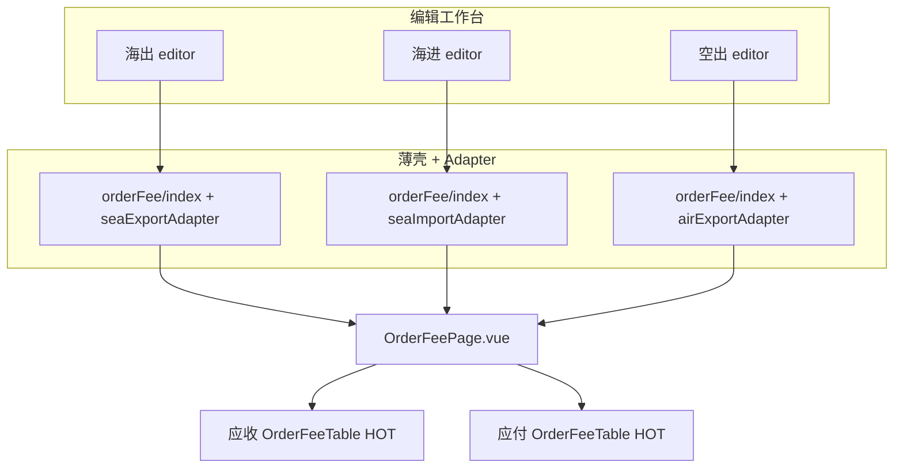
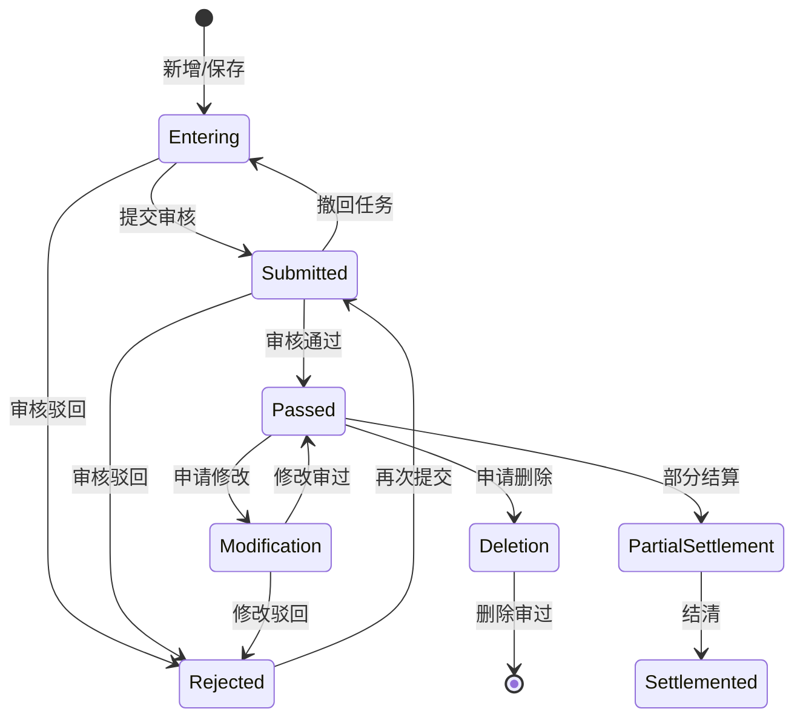

# 应收应付费用录入：完整功能说明

> 本文面向产品、测试与前端开发，描述海运出口 / 海运进口 / 空运出口工作台「应收应付」Tab 的全部逻辑与功能。  
> **实现以 Handsontable 版为准**（`order-fee-table-handsontable.vue`）；VXE `order-fee-table.vue` 已移除。字段联动技术文档仅作对照。

---

## 目录

1. [业务背景与定位](#1-业务背景与定位)
2. [入口与模块适配](#2-入口与模块适配)
3. [页面布局](#3-页面布局)
4. [面板顶栏操作](#4-面板顶栏操作)
5. [应收/应付表头操作](#5-应收应付表头操作)
6. [表格列与展示规则](#6-表格列与展示规则)
7. [行级编辑与字段联动](#7-行级编辑与字段联动)
8. [费用状态与审核流](#8-费用状态与审核流)
9. [专项能力详解](#9-专项能力详解)
10. [底部金额汇总](#10-底部金额汇总)
11. [权限与字段遮罩](#11-权限与字段遮罩)
12. [脏检查与 KeepAlive](#12-脏检查与-keepalive)
13. [更改单模式差异](#13-更改单模式差异)
14. [源码地图与主要 API](#14-源码地图与主要-api)
15. [相关文档](#15-相关文档)

---

## 1. 业务背景与定位

**白话解释：**  
应收应付费用录入是委托单上的费用工作台：按运输单维护「收客户钱」和「付供应商钱」两条明细，支持录入、保存、提交审核、申请修改/删除、打印、批量引入、收付互转、完结标记，以及跳转开票申请 / 付费申请。

**在业务链路中的位置：**

```text
订舱委托 → 费用录入（本页）→ 费用审核 → 对账 / 开票 / 付费申请 → 收付结算 / 核销
```

**不负责什么：**

| 能力 | 归属 |
| --- | --- |
| 费用审核通过/驳回 | `audit-approval/expense-review` |
| 对账单 / 付费申请表单本体 | `fee-management/*` |
| 业务联系单费用表 | `pre-order/modules/fee-table.vue`（**不复用**本共享组件） |

---

## 2. 入口与模块适配

### 2.1 嵌入位置

| 业务 | 工作台路由 | 薄壳组件 | Adapter |
| --- | --- | --- | --- |
| 海运出口 | `/sea-exports/:id/edit` → Tab「应收应付」 | `views/sea-export-admin/orderFee/index.vue` | `adapter/sea-export.ts` |
| 海运进口 | `/sea-imports/:id/edit` → Tab「应收应付」 | `views/sea-import-admin/orderFee/index.vue` | `adapter/sea-import.ts` |
| 空运出口 | `/air-exports/:id/edit` → Tab「应收应付」 | `views/air-export-admin/orderFee/index.vue` | `adapter/air-export.ts` |

薄壳职责：

1. `provide(ORDER_FEE_ADAPTER_KEY, xxxAdapter)`
2. 渲染共享页 `OrderFeePage.vue`
3. `defineOptions({ name: 'OrderFee' })`，供编辑工作台 `KeepAlive include="OrderFee"`
4. 向父级暴露 `isFeeDirty`；监听 `@fee-count-change` 刷新 Tab「应收应付 x - y」角标
5. 接收父级 `:latest-detail`（基础信息保存后的最新详情）

### 2.2 Adapter 差异一览

三模块 UI 与交互同构，差异收敛到 `OrderFeeModuleAdapter`（`types.ts`）：

| 项 | 海运出口 | 海运进口 | 空运出口 |
| --- | --- | --- | --- |
| `bizType` | `0` | `1` | `2` |
| 详情 API | `SeaExportAdmin` | `SeaImportAdmin` | `AirExportAdmin` |
| 费用 CRUD API | `sea-export/order-fee-admin` | `sea-import/order-fee-admin` | **复用海出** order-fee-admin |
| 完结锁 API | `sea-export/fee-lock` | `sea-import/fee-lock` | **复用海出** fee-lock |
| 费用预警 | ✅ `getOrderFeeWarnings` | ❌ 不展示 | ❌ 不展示 |
| 左侧订单字段 | 港口链 / 船名航次 / 截单等 | 到港 / 换单 / 提箱等 | 主单号 / 航班等 |
| 页面 i18n 前缀 | `seaExport.export` | `seaImport.import` | `airExport.export` |
| 列文案 dataI18n | `seaExport.export` | `seaImport.import` | **仍用** `seaExport.export` |
| 打印 `printBizType` | SeaExport | SeaImport | AirExport |

### 2.3 架构示意



---

## 3. 页面布局

整体为左右分栏 + 右侧上下分栏：

```text
┌──────────────┬───┬────────────────────────────────────────────┐
│ 订单信息 Card │拖│ 费用录入面板                                  │
│ （可配置字段） │拽│  ┌ 顶栏：标题 / 已选N条 / 预警 / 结算申请 / 整票提交
│              │条│  ├ 应收表（工具栏 + Handsontable）             │
│              │  │  ├ 上下拖拽条                                  │
│              │  │  ├ 应付表（工具栏 + Handsontable）             │
│              │  │  └ 底部：多币别金额汇总                         │
└──────────────┴───┴────────────────────────────────────────────┘
```

### 3.1 左侧：订单信息

- 标题「订单信息」+ 齿轮：打开「展示字段配置」弹窗，按用户配置显隐字段。
- 字段按分组展示（身份 / 航程 / 港口 / 货物等，见 `display-field-groups.ts`）。
- 船公司可带 Logo（`carrierLogo.url`）。
- 空值显示 `--`。

### 3.2 左右拖拽

- 拖动中间竖条调整订单信息宽度；范围约 **200–560px**。
- 持久化键：`order-fee-info-fee-split-width`。
- **双击**恢复默认宽度（约 300px）。

### 3.3 右侧：费用录入面板

| 区域 | 说明 |
| --- | --- |
| 顶栏 | 标题「费用录入」、已选条数胶囊、共享预警 ticker、「结算申请」下拉、「整票提交」分裂按钮 |
| 应收 / 应付 | 各一张 Handsontable 卡；高度比例 `recRatio`，范围 **20%–80%** |
| 上下拖拽 | 持久化键 `order-fee-rec-pay-split`；**双击**均分 |
| 未完结角标 | 仅主单 + 应收表：业务未完结时左上角「未完结」图 |
| 底部汇总 | 按币别应收/应付/利润 + 本位币合计利润与利润率 |

表格高度由 `OrderFeeTableCore` 的 `ResizeObserver` 动态测量后写入 Handsontable `height`，随分割条变化自适应。

---

## 4. 面板顶栏操作

顶栏右侧现为 **2 个控件**（结算类已收纳，避免按钮过多）：

### 4.1 「结算申请」下拉（default 按钮）

无选中费用时菜单项禁用；权限挂在各 `MenuItem` 上。

| 菜单项 | 权限 | 前置条件 | 行为 |
| --- | --- | --- | --- |
| 创建开票申请 | `Admin.InvoiceApplication.Add` | 已勾选费用 | 前端校验可开票条件 → 跳转 `/fee-management/invoice-application/add?orderFeeIds=` |
| 创建付费申请 | `Admin.PaymentApplication.Add` | 已勾选；组合状态审核通过/部分结算；同一结算对象等 | 跳转前可调 `GetOrderFeeGroupAsync` 回捞 → `/fee-management/payment-application/add?orderFeeIds=` |
| 批量改结算对象 | `Admin.OrderFee.Edit` | 仅一种收付；全部审核通过；主单与更改单费用不混选 | 弹窗选结算对象 → `BatchModifyOrderFeeSettlementAsync`；应付备注必填走申请修改流；应收直接改库 |

**开票回捞常见拦截（前端提示）：** 非审核通过、票已锁定、有在审任务、无可开票额度等。

**付费常见拦截：** 组合状态不符、申请修改/删除在审、结算对象不一致、无可申请明细。

### 4.2 「整票提交」分裂按钮（primary）

- **主按钮点击**：提交。
  - 若有勾选：提交勾选中「录入 + 驳回」费用。
  - 若无勾选：提交整票两侧全部「录入 + 驳回」费用。
- **下拉项：**

| 项 | 前置 | 接口 / 行为 |
| --- | --- | --- |
| 申请修改 | 恰好 1 条且费用状态为审核通过 | 打开表内修改弹窗 → `ModifyOrderFeeAsync` |
| 申请删除 | ≥1 条；弹窗填删除原因 | `DeleteOrderFeeAsync` |
| 撤回 | ≥1 条 | `OrderFeeTaskWithdraw`（撤回在审任务） |

**负利润备注：** 提交前若按「本批提交 ∪ 同归属下非录入/非驳回费用」估算利润为负，弹窗必填备注（主单与更改单分算）。见 `prompt-submit-remark.ts`。

成功后：提示成功、刷新应收/应付两表、更新费用数量角标。

---

## 5. 应收/应付表头操作

每张表右侧工具栏分层：

| 层级 | 按钮                           | 样式                   |
| ---- | ------------------------------ | ---------------------- |
| 主   | 新增、保存                     | `primary` small        |
| 次   | 删除                           | `danger` ghost；需勾选 |
| 特色 | AI识别（**仅应付**、非更改单） | `primary` ghost，外显  |
| 收纳 | 「更多」下拉                   | default                |

### 5.1 外显按钮

| 操作 | 条件 | 行为 |
| --- | --- | --- |
| 新增 | 表非只读 | 本地插入空行（带临时 `_rowKey`） |
| 保存 | **更改单模式隐藏** | 仅提交「录入 / 驳回」且未对账的行 → `BatchEditAsync` |
| 删除 | 有勾选 | 主单：有 id 的行调 `DeleteAsync`；无 id 仅本地移除。更改单：仅本地删，随更改单整包保存 |
| AI识别 | `type===1` 且非更改单 | 上传账单 → `GeminiAdmin/ExtractBillFeesAsync` → 结果弹窗勾选引入 |

### 5.2 「更多」菜单

| 项 | 条件 | 行为 |
| --- | --- | --- |
| 打印 | — | 应收 `PrintJsonType=1000` / 应付 `1500`；可按勾选 id 只打部分；模板按 `bizType` + 签单/船公司/组织筛选 |
| 批量引入 | 非更改单、非只读 | 按船公司/港口等搜历史票费用 → `ImportOrderFeesToTransportOrderAsync` |
| 应收生成应付 / 应付生成应收 | 非只读 | 勾选已保存行 → `GenerateOppositeOrderFeesAsync` → 刷新本表 + 对立表 |
| 设为已完结 / 未完结 | **仅应收**、非更改单 | `TransportOrderAdmin/ChangeIsUnfinishedAsync` |

### 5.3 表头左侧

- 标题：应收费用 / 应付费用
- **费用排序**：进入拖拽排序模式（虚线次要按钮）；保存 → `SortOrderFeesAsync`；重置 → `RestoreOrderFeeSortAsync`；取消退出模式
- 预警 ticker（按收付拆分的预警项）
- 勾选行按币别原币合计（与页脚口径不同，仅当前表勾选）

---

## 6. 表格列与展示规则

### 6.1 列顺序（左 → 右）

勾选 | 序号 | 开票状态 | 费用状态 | 费用代码 | 行业类别 | 结算对象 | 币别 | 汇率 | 含税单价 | 含税金额 | 单位 | 数量 | 税率 | 不含税单价 | 不含税金额 | 对账单号 | 申请付款金额 | 已开票 | 发票申请金额 | 已结算 | 不开发票 | 保密 | 备注 | 录入方式 | 创建人 | 创建时间

### 6.2 默认可编辑 / 只读

| 可编辑（受状态与权限约束） | 只读展示 |
| --- | --- |
| 费用代码、行业类别、结算对象、币别、汇率、含税单价/金额、单位、数量、税率、不开发票、保密、备注 | 开票状态、费用状态、不含税单价/金额、对账单号、申请付款/已开票/发票申请/已结算金额、录入方式、创建人、创建时间 |

### 6.3 行级只读（Handsontable `cells` / `beforeChange`）

统一入口：`isSavableOrderFeeRow`（`helpers.ts`）——与批量保存、整票提交过滤同一口径。

1. **非录入/驳回**：`combinedFeeStatus ?? feeStatus` 非 0/5（含申请修改 6、申请删除 7）→ 行不可内联改
2. **已对账**：`statements` 非空或 `isStatemented` → 不可编辑/不可批量保存
3. **字段权限遮罩**：`fieldPermission.masked(field, row)` → 该格只读且显示 `***`
4. **更改单锁定 / 排序模式**：整表 `readOnly`

> `canEditFee`（`data.ts`）仅识别录入(0)/驳回(5)；历史注释曾误写驳回=3、申请修改=4，已更正。申请修改/删除须走弹窗，不可表内直改。

### 6.4 费用状态底色

`afterRenderer` 按 `combinedFeeStatus ?? feeStatus` 取色，透明度约 `30%`（色值后拼 `30`）：

| value | 文案     | 色        |
| ----- | -------- | --------- |
| 0     | 录入状态 | `#b8cdd7` |
| 1     | 提交审核 | `#ffc107` |
| 2     | 审核通过 | `#67c23a` |
| 3     | 部分结算 | `#87CEEB` |
| 4     | 结算完毕 | `#1E90FF` |
| 5     | 驳回     | `#f56c6c` |
| 6     | 申请修改 | `#ff9900` |
| 7     | 申请删除 | `#ff9900` |

**权限遮罩格 `\***` 也会套用同一行状态底色\*\*（与整行对齐）；预警高亮红底优先于状态色。

### 6.5 其它单元格表现

| 表现 | 说明 |
| --- | --- |
| 已修改角标 | 用户改动或联动写入后 `_editedFields` 标记；角标 CSS `cell-edited-mark`；title「该单元格已修改」 |
| 驳回提示 | 费用状态旁可悬停看最近驳回意见；双击费用状态打开审核历史弹窗 |
| 预警高亮 | 悬停预警 ticker → 对应 `orderFeeIds` 整行 `#ffccc7` |

加载时：审核通过费用会按 `settledAmount` **派生**组合状态为 2 / 3 / 4（通过 / 部分结算 / 结清）。

---

## 7. 行级编辑与字段联动

核心实现：`useOrderFeeLinkage.ts`。订单详情优先用父组件下发的 `orderDetail` / `latest-detail`，避免重复打详情接口。

### 7.1 选费用代码

自动串联：

1. **行业类别**
   - 应收 ← 费用代码 `defaultDebit`
   - 应付 ← 费用代码 `defaultCredit`
2. **结算对象**（按行业字母映射订单干系人 / 往来单位，如 `p`→委托单位、`o`→订舱代理、`c`→场站…）
3. **币别** ← 费用代码默认币别
4. **汇率**
   - 若币别 = 所属公司本位币 → 锁 `1`
   - 否则取「费用币别兑本位币」且业务日期有效的汇率（海出业务日多为开船日）；对不上则留空手填
   - 应收侧用 `drValue`、应付侧用 `crValue`（历史曾因布尔误判互换，已修复）
5. **税率** ← `resolveFeeTaxRate(结算对象客户税率, 费用代码税率)`（客户税率可空）
6. **单位 / 数量**
   - 票 / ORDER → 数量 `1`
   - 箱型 / CTN → 按 `orderCtns` 填单位与同箱型个数
   - 毛重 / 尺码 / 件数 / TEU → 取运单对应字段或累加 TEU

### 7.2 其它联动

| 触发字段 | 效果 |
| --- | --- |
| 行业类别 | 重填结算对象 |
| 币别 | 重算汇率；清空币别则清空汇率 |
| 单位 | 按单位类型重填数量 |
| 含税单价 / 数量 | `金额 = 单价 × 数量`；重算不含税价税 |
| 含税金额 | 反推单价；重算不含税 |
| 税率 | `不含税单价 = 含税单价 / (1 + 税率/100)`；`不含税金额 = 不含税单价 × 数量` |

### 7.3 下拉数据源

`useDropdownSources`：费用代码、行业类别、币别、单位、按行业缓存的客户列表等。页面挂载时父级可一次性 `loadAllClients`，子表复用缓存。

---

## 8. 费用状态与审核流

### 8.1 状态机（业务视角）



### 8.2 本页可发起的动作

| 动作 | 允许的费用状态（概要） | 接口 |
| --- | --- | --- |
| 保存 | 录入(0)、驳回(5)，且未对账 | `BatchEditAsync` |
| 提交审核 | 录入、驳回 | `SubmitOrderFeeAsync` |
| 申请修改 | 审核通过(2)；表内另可能要求开票/结算/申请付款金额为 0 | `ModifyOrderFeeAsync` |
| 申请删除 | 有勾选 + 原因；表内可能要求金额字段全 0 | `DeleteOrderFeeAsync` |
| 撤回 | 有在审任务的勾选行 | `OrderFeeTaskWithdraw` |

审核通过 / 驳回本身在「费用审核」模块完成，不在本页操作。

---

## 9. 专项能力详解

### 9.1 批量引入

1. 打开弹窗，按船公司 / 起运港 / 目的港 / 业务类型等检索历史运输单费用。
2. 勾选后确认 → `ImportOrderFeesToTransportOrderAsync`。
3. 刷新本表并通知对立表刷新。
4. **更改单不支持**。

### 9.2 收付互生

勾选已保存费用 → 「应收生成应付」或「应付生成应收」→ `GenerateOppositeOrderFeesAsync` → 两边表刷新。用于快速生成镜像费用。

### 9.3 AI 识别账单（应付）

1. 上传 PDF/图片等 → `ExtractBillFeesAsync`。
2. 结果弹窗展示识别费用，可勾选引入。
3. 提单号不一致时 Confirm 提示。
4. 列表页跨票场景可用 `ai-bill-fee-pending` 暂存，进入对应票费用页自动弹出确认。

### 9.4 费用排序

1. 点「费用排序」进入模式：左侧出现拖动手柄，行可 ManualRowMove。
2. 「保存排序」按视觉顺序写 `sortId`。
3. 「重置排序」按创建时间恢复。
4. 排序中其它工具栏按钮隐藏。

### 9.5 打印

- 数据由后端按 `transportOrderId`（或更改单 id）取数。
- 勾选已保存费用时传 `orderFeeListInput.ids` 只打勾选；未勾选打整侧费用。
- 未保存行一般拦截或提示。

### 9.6 完结状态（应收）

标记运输单业务「已完结 / 未完结」，影响角标展示；不替代费用锁定。接口在 `TransportOrderAdmin`。

### 9.7 批量改结算对象

见 §4.1。一次只能改一种收付方向的已审核费用。

### 9.8 费用预警（海出）

`GetOrderFeeWarningsAsync` 返回分组项（含费用名、币别、相关费用 id）。  
展示在：面板顶栏共享区、应收/应付表头 ticker。悬停高亮对应行。

---

## 10. 底部金额汇总

子表各自按币别汇总后 `@update-amount` 上报，页脚展示：

| 项                 | 口径                                                  |
| ------------------ | ----------------------------------------------------- |
| 应收{币别}         | 该币别应收原币合计                                    |
| 应付{币别}         | 该币别应付原币合计                                    |
| 利润{币别}         | 原币应收 − 原币应付（同币别）                         |
| 合计利润（本位币） | Σ(应收×汇率) − Σ(应付×汇率)                           |
| 利润率             | 合计利润 / 合计 RMB 应付 × 100%；应付为 0 时显示 `--` |

表头「勾选汇总」只统计**当前表勾选行**的原币合计，与页脚整表口径不同。

---

## 11. 权限与字段遮罩

| 能力 | 权限码 / 机制 |
| --- | --- |
| 表头新增 | `Admin.OrderFee.Add`（`v-access`） |
| 表头保存 / 提交类 | `Admin.OrderFee.Edit` |
| 表头删除 | `Admin.OrderFee.Delete` |
| 创建开票申请 | `Admin.InvoiceApplication.Add` |
| 创建付费申请 | `Admin.PaymentApplication.Add` |
| 批量改结算对象 | `Admin.OrderFee.Edit` |
| 字段级不可见 | 业务字段权限 `orderFeeFieldPermission`（`FrightModule.OrderFee`）+ `loadMaskedFields`；单元格显示 `***`，`beforeChange` 拦截写入 |
| 费用锁定 | 财务费用锁定后，更改单可只读；主单编辑受后端与锁定状态约束 |

雪花 ID、金额关联外键一律 **string 透传**，禁止 `Number(id)`。

---

## 12. 脏检查与 KeepAlive

### 12.1 脏检查

- 行快照：`createFeeTableDirtyTracker`（忽略 `_rowKey` 等临时键）。
- 加载/保存成功后 `syncFeeSnapshot`。
- `OrderFeePage.isFeeDirty` = 应收脏 **或** 应付脏。
- 编辑工作台 `useUnsavedGuard` 将其与基础信息等一并纳入；切 Tab / 关页签会二次确认。

### 12.2 KeepAlive

- 组件名 `OrderFee`，工作台 `include="OrderFee"`。
- `useKeepAliveRouteParamId` 冻结路由 id，避免切到其它业务页同名 `:id` 时串单。
- 基础信息保存成功：海出/海进/空出编辑页均 `clearOrderDetailCache(editId)`，避免费用联动仍用旧详情。
- 费用页挂载只调 `getOrderFeeCount` 刷角标；金额汇总由子表 `@update-amount` 上报，**不再**额外 `PageSize:999` 拉全量列表。
- `onActivated` 重绑 i18n。

---

## 13. 更改单模式差异

更改单页 **不挂** `OrderFeePage`，而是直接 `provide` adapter + 双表（或页签切换单侧表）；海出/海进/空出均复用 `order-fee-table-handsontable.vue`：

| 项 | 主单费用页 | 更改单 |
| --- | --- | --- |
| 容器 | `OrderFeePage` | 更改单编辑器内嵌表 |
| `mode` | 默认 | `changeOrder` |
| 保存按钮 | 有 | **隐藏**（随更改单整单保存） |
| AI / 完结 | 有（应付 AI / 应收完结） | **无** |
| 批量引入 | 有 | 禁用 |
| 删除 | 调删除 API | 多本地删除 |
| 锁定 | 视费用锁 | `readonly` 遮罩「该更改单已锁定，费用仅可查看」 |
| 打印 | 普通费用打印 | 可走更改单打印上下文 |

---

## 14. 源码地图与主要 API

### 14.1 源码结构

```text
apps/web-antd/src/views/_shared/order-fee/
├── OrderFeePage.vue                 # 页面壳：布局、顶栏、汇总
├── types.ts / use-adapter.ts        # Adapter 协议
├── data.ts                          # 列定义、状态枚举、可编辑规则
├── display-field-groups.ts          # 左侧订单信息分组
├── adapter/
│   ├── sea-export.ts
│   ├── sea-import.ts
│   └── air-export.ts
├── modules/
│   ├── order-fee-table-handsontable.vue   # 单侧费用表（主单 + 更改单）
│   ├── OrderFeeTableCore.vue              # HotTable 封装
│   ├── all-order-fee-table.vue            # 审核详情等只读表
│   ├── batch-import-fee-modal.vue
│   ├── batch-modify-settlement-modal.vue
│   ├── ai-bill-fee-*.vue
│   ├── order-fee-editor-modal.vue         # 申请修改
│   ├── order-fee-audit-history-modal.vue
│   ├── order-fee-warning-ticker.vue
│   ├── display-fields-config-modal.vue
│   └── composables/
│       ├── useOrderFeeData.ts
│       ├── useOrderFeeActions.ts
│       ├── useOrderFeeLinkage.ts
│       ├── useHotColumns.ts / useHotSettings.ts
│       ├── useDropdownSources.ts
│       ├── useFinishStatus.ts
│       ├── useOrderFeePrint.ts
│       ├── useOrderFeeSort.ts
│       ├── useOrderFeeWarnings.ts
│       └── useModals.ts
└── 业务费用表格字段映射与数据联动技术文档.md
```

薄壳：

- `views/sea-export-admin/orderFee/index.vue`
- `views/sea-import-admin/orderFee/index.vue`
- `views/air-export-admin/orderFee/index.vue`

跳转付费/开票：

- `views/fee-management/payment-application/open-from-order-fees.ts`
- `views/fee-management/invoice-application/open-from-order-fees.ts`

### 14.2 主要 API（示意）

前缀多为 `/services/app/OrderFeeAdmin/`：

| 能力 | 方法名（示意） |
| --- | --- |
| 分页列表 | `GetPagedListAsync` |
| 数量统计 | `GetOrderFeeCountAsync` |
| 批量保存 | `BatchEditAsync` |
| 批量删除 | `DeleteAsync` |
| 收付互生 | `GenerateOppositeOrderFeesAsync` |
| 历史费用 / 引入 | `GetTransportOrderFeesAsync` / `ImportOrderFeesToTransportOrderAsync` |
| 排序 | `SortOrderFeesAsync` / `RestoreOrderFeeSortAsync` |
| 预警 | `GetOrderFeeWarningsAsync` |
| 提交 / 申请改删 | `SubmitOrderFeeAsync` / `ModifyOrderFeeAsync` / `DeleteOrderFeeAsync` |
| 批量改结算对象 | `BatchModifyOrderFeeSettlementAsync` |
| 撤回 | 任务撤回相关接口（如 `OrderFeeTaskWithdraw`） |

其它：

| 能力 | 路径示意 |
| --- | --- |
| 完结状态 | `/services/app/TransportOrderAdmin/GetIsFinishedAsync`、`ChangeIsUnfinishedAsync` |
| AI 识单 | `/services/app/GeminiAdmin/ExtractBillFeesAsync` |
| 业务详情 | 各模块 `*Admin/DetailAsync`（或 GetDetail） |
| 更改单详情 | `ChangeOrderAdmin/...` |

响应约定：`success` → `result`；ID 保持字符串。

---

## 15. 相关文档

| 文档 | 说明 |
| --- | --- |
| [海运出口编辑工作台](../sea-exports/id-edit.md) | 费用 Tab 在海出工作台中的嵌入与角标 |
| [更改单](../sea-exports/change-order.md) | 更改单内嵌费用表 |
| [费用审核](../audit-approval/expense-review.md) | 提交后的审核端 |
| [付款申请新增](../fee-management/payment-application-add.md) | 从本页带 `orderFeeIds` 预填 |
| [未保存离开拦截](./unsaved-guard.md) | 脏检查全局协议 |
| `views/_shared/order-fee/业务费用表格字段映射与数据联动技术文档.md` | 字段联动技术细节（含历史 VXE） |
| `doc/业务费用/*` | 业务费用模块接口与审核工作流 |

---

## 16. 变更摘要（文档）

| 日期 | 说明 |
| --- | --- |
| 2026-09-20 | 初版：整理应收应付费用录入全量功能（布局、工具栏收纳后现状、联动、状态、API、更改单差异）。 |
