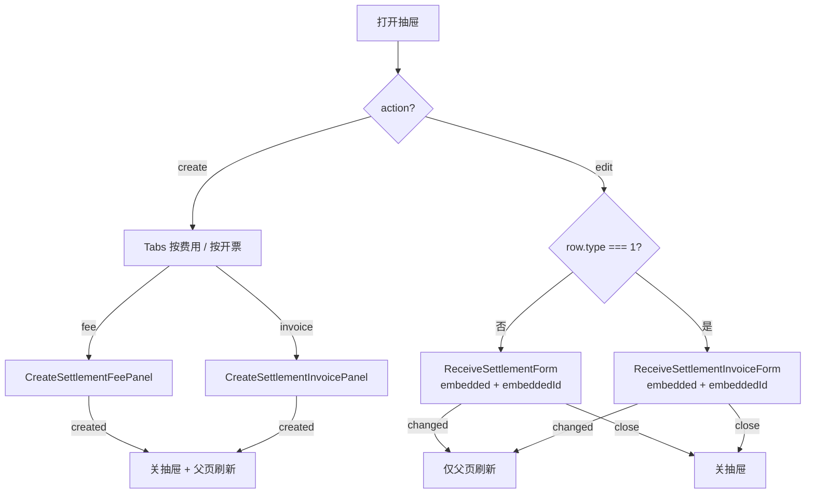

# 银行流水核销抽屉逻辑

> **宿主页面：** `/bank-statement/edit/:id`  
> **组件：** `settlement-workbench-drawer.vue`  
> **作用：** 在不离开银行流水工作台的前提下，完成收费核销的**新增**与**查看/编辑**。

---

## 1. 抽屉总览

### 1.1 两种模式

| 模式 | `action` | 标题 | 内容 |
| :-- | :-- | :-- | :-- |
| **新增** | `create` | 新增收费核销 | Tabs：按费用核销 / 按开票申请核销 |
| **编辑** | `edit` | `收费核销 · {单号}` | 按核销单 `type` 嵌入费用表单或发票表单 |

### 1.2 打开入口

| 入口 | 调用 | 初始状态 |
| :-- | :-- | :-- |
| 汇总条「新增收费核销」 | `openCreate('fee')` | create + Tab「按费用」 |
| 汇总条「按开票申请核销」 | `openCreate('invoice')` | create + Tab「按开票申请」 |
| 关联列表「查看/编辑」或双击行 | `openEdit(row)` | edit；`type===1` 走发票表单，否则走费用表单 |

### 1.3 外壳行为

| 项 | 规则 |
| :-- | :-- |
| 宽度 | `min(1280px, 94vw)` |
| 销毁 | `destroy-on-close`：关闭后销毁内容，下次打开重新挂载 |
| Tab 切换 | 新增模式下 `destroy-inactive-tab-pane`：切 Tab 会销毁未激活面板（勾选不保留） |
| 父页传参 | 一律用**已保存流水快照**：`bankStatementId`、金额、已核销、付款方、币别 |

### 1.4 与父页的事件契约

```text
抽屉 changed ──► form.handleSettlementCreated ──► loadEditData()
                 （重拉流水详情 + 已核销汇总 + 关联列表）
```

| 子事件              | 抽屉处理                | 是否关抽屉         |
| :------------------ | :---------------------- | :----------------- |
| 建单面板 `@created` | `handleChanged(true)`   | **是**             |
| 嵌入表单 `@changed` | `handleChanged()`       | **否**（继续编辑） |
| 嵌入表单 `@close`   | `closeDrawer()`         | 是                 |
| 嵌入表单删除成功    | 先 `changed` 再 `close` | 是                 |

---

## 2. 模式分流图



---

## 3. 新增模式：按费用核销

**组件：** `create-settlement-fee-panel.vue`

### 3.1 数据与筛选

- 列表接口：`GetOrderFeeGroupAsync`（可结算费用按业务单分组）。
- 付款方名、币别随流水传入并写入搜索表单，**界面隐藏**（不可改成别的客户/币别）。
- 可见筛选：委托号、主提单号等（与收费核销选费抽屉同源 schema，去掉结算对象/币别展示）。
- 无 `settlementId` 或 `currencyId` 时不拉数。

### 3.2 勾选与金额

- 展开业务单 → 勾选费用行 → 录入「本次结算金额」。
- 改金额会自动勾选该行；默认可用费用剩余额度预填。
- 顶部实时展示：**本批合计**、**剩余可结算**  
  `剩余可结算 = 流水金额 - 已核销 - 本批合计`

### 3.3 创建前校验

| 规则             | 说明                              |
| :--------------- | :-------------------------------- |
| 至少一条         | 未勾选则拦截                      |
| 金额 > 0         | 每条本次结算金额必须大于 0        |
| 单笔不超费用剩余 | `settledAmount ≤ remainingAmount` |
| 不超流水剩余     | 本批合计 ≤ `流水金额 - 已核销`    |

### 3.4 提交

- 接口：`ReceiveSettlementAdmin/AddAsync`
- Payload 要点：
  - `bankStatementId` = 当前流水
  - `settlementTime` = 当前时刻 ISO
  - `receiveSettlementItems[]`：`orderFeeId` + `settledAmount`
- 成功：提示 → 标记收费核销/银行流水列表刷新 → `emit('created')` → 抽屉关闭 → 父页重载。

---

## 4. 新增模式：按开票申请核销

**组件：** `create-settlement-invoice-panel.vue`

### 4.1 数据与筛选

- 列表接口：`GetInvoiceApplicationGroupForSettlement`（开票申请分组）。
- 付款方/币别同样隐藏锁定。
- 开关「仅显示可结算」默认 **开**（`onlySettleable = true`）。

### 4.2 勾选与净额

- 展开开票申请 → 勾选开票明细 → 录入结算金额。
- **占用流水额度用净额，不是面值合计：**

```text
toNetAmount(paySide, amount) =
  paySide === 1（付） ? -amount : +amount
```

- 顶部展示：**本批净额**、**剩余可结算**  
  `剩余可结算 = 流水金额 - 已核销 - 本批净额`

### 4.3 创建前校验

| 规则 | 说明 |
| :-- | :-- |
| 至少一条开票明细 |  |
| 金额 > 0 |  |
| 发票口径余额 | 同一 `orderFeeId` 下多条明细消耗之和 ≤ 该费用 `invoiceSettleableAmount` |
| 不超流水剩余 | 本批净额 ≤ `流水金额 - 已核销` |

### 4.4 提交

- 接口：`AddByInvoiceApplicationAsync`
- Payload：`bankStatementId`、`settlementTime`、`items[]`（`invoiceApplicationItemId` + `settledAmount`）
- 成功后同费用模式：关抽屉 + 父页刷新。

---

## 5. 编辑模式：嵌入核销表单

### 5.1 路由分流

| `editingRow.type` | 嵌入组件           | 业务含义               |
| :---------------- | :----------------- | :--------------------- |
| `1`               | `invoice-form.vue` | 发票结算（按开票申请） |
| 其他（含 `0`）    | `form.vue`         | 费用结算（按费用）     |

### 5.2 嵌入约定（关键）

```vue
<XxxForm :embedded-id="editingRow.id" embedded @changed @close />
```

| Prop / 行为 | 规则 |
| :-- | :-- |
| `embeddedId` | **核销单 ID**；优先级高于路由 `params.id`（避免读成银行流水 ID） |
| `embedded` | 返回按钮文案为「关闭」；点击只 `emit('close')`，不 `router.back()` |
| 保存主信息成功 | `emit('changed')`，**不关**抽屉，原地重载核销详情 |
| 删除成功 | `emit('changed')` + `emit('close')` |
| 锁定/解锁/明细增删 | 一般会触发 `changed`（父页金额刷新）；是否关抽屉看具体操作（删除才关） |

### 5.3 嵌入后仍可用的核销能力

与独立路由页一致（受核销单锁定状态与权限控制）：

- 查看/编辑主信息（结算时间、备注等）
- 增删费用或开票明细
- 锁定 / 解锁
- 删除整单
- 权限点：`Admin.ReceiveSettlement.Edit/Delete/Lock/Unlock` 等

### 5.4 与独立页差异

| 场景   | 独立路由         | 银行流水抽屉嵌入         |
| :----- | :--------------- | :----------------------- |
| 关闭   | 返回列表或上一页 | 仅关抽屉，留在流水工作台 |
| 删除后 | 跳转收费核销列表 | 关抽屉 + 刷新流水汇总    |
| 取 ID  | 路由 `:id`       | **必须** `embeddedId`    |

---

## 6. 金额与快照（抽屉侧关键规则）

| 概念 | 来源 | 说明 |
| :-- | :-- | :-- |
| `bankStatementAmount` | 父页 `savedAmount` | 已落库流水金额，不是表单草稿 |
| `otherSettledAmount` | 父页已核销汇总 | 本流水下已有核销单合计 |
| `settlementId/Name`、`currencyId/Code` | 父页快照 | 建单筛选锁定条件 |
| 本批占用 | 抽屉内勾选实时算 | 费用用合计；发票用净额 |
| 可建剩余 | `流水 - 已核销 - 本批` | `< 0` 时标红并禁止提交 |

**注意：** 父页若改了金额/付款方但未点保存，打开抽屉仍按旧快照校验与筛费。

---

## 7. 关闭与刷新时机速查

| 用户动作 | 关抽屉？ | 父页刷新？ |
| :-- | :-- | :-- |
| 新建费用核销成功 | 是 | 是 |
| 新建发票核销成功 | 是 | 是 |
| 嵌入表单保存主信息 | 否 | 是 |
| 嵌入表单增删明细（触发 changed） | 否 | 是 |
| 嵌入表单锁定/解锁（触发 changed） | 否 | 是 |
| 嵌入表单删除整单 | 是 | 是 |
| 点「关闭」/遮罩关闭 | 是 | 否（无 changed 则不刷） |
| 新增态切换 Tab | 否 | 否（未激活 Tab 销毁，勾选丢失） |

---

## 8. 易错点

1. **编辑必须用 `embeddedId`**，禁止用银行流水路由 ID 当核销单 ID。
2. **新增成功关抽屉；编辑保存不关**——只有删除或主动关闭才关。
3. **发票核销看净额**（付为负），不能按勾选金额简单相加对比流水剩余。
4. **同一费用多条开票明细**要按 `orderFeeId` 聚合校验发票可结算余额。
5. **`destroy-on-close` + Tab `destroy-inactive-tab-pane`**：关闭或切 Tab 会丢未提交勾选。
6. **父页 `changed` 必须重载**：否则顶部已核销/剩余、核销状态 Tag、关联列表都会滞后。

---

## 9. 源码索引

| 文件 | 职责 |
| :-- | :-- |
| `bank-statement/components/settlement-workbench-drawer.vue` | 抽屉外壳、模式切换、事件转发 |
| `bank-statement/components/create-settlement-fee-panel.vue` | 按费用建单 |
| `bank-statement/components/create-settlement-invoice-panel.vue` | 按开票申请建单 |
| `receive-settlement/form.vue` | 费用核销嵌入编辑 |
| `receive-settlement/invoice-form.vue` | 发票核销嵌入编辑 |
| `bank-statement/form.vue` | 打开抽屉、监听 `changed` 刷新工作台 |
