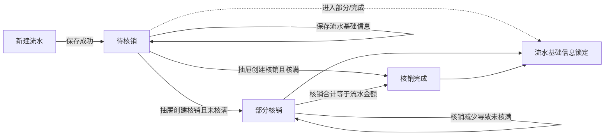

# 银行流水编辑页业务逻辑说明

> **页面路径：** `/bank-statement/edit/:id`（示例：`/bank-statement/edit/83744d2c-1588-46c1-8c45-bb6df7ecf080`）  
> **菜单入口：** 财务管理 → 银行流水 → 双击进入编辑  
> **页面定位：** 财务到账后的**收费核销工作台**（不是单纯的流水字段维护页）  
> **权限标识：** `Admin.BankStatement`（流水）、`Admin.ReceiveSettlement`（核销）  
> **参考活文档：** [银行流水编辑](../modules/settlement-management/bank-statement-edit.md)

---

## 1. 业务一句话

银行流水记录客户实际到账金额；本页以该笔到账为中心，维护流水基础信息，并把到账金额通过「收费核销单」分摊到费用或开票申请上，同时持续展示**流水金额 / 已核销 / 剩余可核销**。

---

## 2. 页面结构（编辑态）

```text
┌─ 标题栏 ──────────────────────────────────────────────┐
│ 编辑银行流水 | 可核销操作人(Tag)     [返回] [保存?]   │
├─ 汇总条 ──────────────────────────────────────────────┤
│ 流水号 + 核销状态Tag + 创建人/付款方                    │
│ 流水金额 | 已核销 | 剩余可核销                        │
│ [按开票申请核销] [新增收费核销]（条件可见）            │
│ （非待核销时提示：基础信息已锁定）                    │
├─ 主体双栏 ────────────────────────────────────────────┤
│ 左：流水信息表单          右：关联核销单列表          │
└───────────────────────────────────────────────────────┘
右侧宽抽屉：新增核销（按费用/按开票）或编辑已有核销单
```

新建页（`/bank-statement/add`）只有标题栏 + 流水信息；保存成功后跳转到本编辑页。

---

## 3. 核销状态与可操作边界

| 状态值 | 中文 | 业务含义（后端口径） | 本页流水基础信息 | 本页核销操作 |
| :-- | :-- | :-- | :-- | :-- |
| `0` PendingWriteOff | 待核销 | 尚无对应收费结算，或未开始核销 | **可编辑**（需 Edit 权限） | 可新建核销（有剩余且有 Add 权限） |
| `1` PartialWriteOff | 部分核销 | 已有核销，但核销合计 ≠ 流水金额 | **锁定** | 可继续新建/查看编辑核销单 |
| `2` WriteOffCompleted | 核销完成 | 核销合计 = 流水金额 | **锁定** | 一般剩余为 0，新建按钮隐藏；仍可打开已有核销单查看/编辑 |

### 3.1 流水能否编辑（前端规则）

```text
canEditStatement =
  新建页
  OR (有 Admin.BankStatement.Edit 且 writeOffStatus === 待核销)
```

- 不满足时：隐藏「保存」、禁用流水字段与「可核销操作人」维护。
- 非待核销时展示黄条提示：流水已进入核销流程，基础信息锁定；核销单仍可在下方处理。

### 3.2 能否点「新增核销」

```text
canCreateSettlement =
  编辑页
  AND 有 Admin.ReceiveSettlement.Add
  AND 剩余可核销 ≠ 0
```

剩余为 0（核销完成）时隐藏新建按钮；剩余为负时按钮仍可出现（需关注超核销数据），金额标红。

---

## 4. 金额汇总逻辑

| 指标 | 计算方式 | 数据来源 |
| :-- | :-- | :-- |
| **流水金额** | 已落库的流水 `amount` | 详情接口；表单未保存修改**不**即时改汇总 |
| **已核销** | 关联核销单 `totalSettledAmount` 合计 | 优先详情 `settledAmount`；再拉关联列表 pageSize=500 汇总校正 |
| **剩余可核销** | `流水金额 - 已核销` | 前端计算；`< 0` 时标红 |

**重要：** 抽屉内新建/编辑/删除核销后，必须重新加载流水详情 + 关联列表，否则三项金额会滞后。

---

## 5. 功能业务逻辑分册

### 5.1 可核销操作人

| 项 | 说明 |
| :-- | :-- |
| 含义 | 指定**除流水创建人以外**还可执行核销的人员 |
| 空配置 | 文案：未指定；流水创建人仍可核销 |
| 维护方式 | Tag 展示 + Popover 内增删（用户 + 备注） |
| 何时可改 | 仅 `canEditStatement` 为真时 |
| 保存 | 随流水 `EditAsync` / `AddAsync` 一并提交 `bankStatementUsers` |
| 授权真相源 | **后端最终校验**；详情仅有 `creatorUserName`、无 `creatorUserId`，前端不能用姓名比对判断「是否创建人」 |

### 5.2 流水信息字段

| 字段                   | 必填 | 规则                         |
| :--------------------- | :--- | :--------------------------- |
| 流水号                 | —    | 只读，系统生成               |
| 核销状态               | —    | Tag 只读                     |
| 交易时间               | 是   | 日期                         |
| 币别                   | 是   |                              |
| 总金额                 | 是   | ≥ 0，两位小数                |
| 付款方                 | 是   | 客户；变更时清空「对方银行」 |
| 手续费                 | 否   | ≥ 0                          |
| 我司银行               | 否   | 组织银行账户                 |
| 对方银行               | 否   | 依赖付款方；未选付款方禁用   |
| 交易备注 / 留言 / 备注 | 否   |                              |

保存成功：停留本页并刷新；标记银行流水列表需刷新。

### 5.3 关联核销单列表

右侧只展示**核销单级**信息，不再在主界面展开费用明细：

| 列                       | 说明                      |
| :----------------------- | :------------------------ |
| 核销单号                 |                           |
| 核销方式                 | type：费用结算 / 发票结算 |
| 状态                     | 核销单自身状态 Tag        |
| 核销金额                 | `totalSettledAmount`      |
| 明细                     | 明细条数                  |
| 创建人 / 核销时间 / 备注 |                           |
| 操作                     | 「查看 / 编辑」           |

交互：

- 单号搜索 + 分页
- 点击「查看 / 编辑」或双击行 → 打开右侧抽屉编辑对应核销单
- 按 `type` 分流：发票结算打开发票表单，否则打开费用核销表单

### 5.4～5.5 核销抽屉（独立详述）

新增（按费用 / 按开票）与编辑（嵌入收费核销表单）的完整逻辑、事件契约、校验与关闭时机，见专文：

→ **[银行流水核销抽屉逻辑](./bank-statement-drawer-prd.md)**

摘要：

- 新建成功：**关抽屉** + 父页刷新；编辑保存：**不关** + 父页刷新；删除：**关抽屉** + 刷新。
- 建单用已保存流水快照；发票按**净额**占用剩余；嵌入编辑必须用 `embeddedId`（核销单 ID）。

---

## 6. 状态流转（业务视角）



| 当前 | 动作 | 结果 |
| :-- | :-- | :-- |
| 新建 | 保存 | 跳转编辑页，通常为待核销 |
| 待核销 | 保存流水 | 仍待核销，刷新页面数据 |
| 待核销 / 部分核销 | 抽屉创建核销 | 可能变为部分核销或核销完成；刷新汇总与列表 |
| 部分核销 / 核销完成 | 查看流水 | 基础信息只读；核销单可继续处理（受核销单自身锁定等规则约束） |

---

## 7. 权限矩阵（本页相关）

| 权限                          | 作用                                        |
| :---------------------------- | :------------------------------------------ |
| `Admin.BankStatement`         | 进入页面查看                                |
| `Admin.BankStatement.Edit`    | 待核销时保存流水、维护可核销操作人          |
| `Admin.ReceiveSettlement.Add` | 显示并使用「新增收费核销 / 按开票申请核销」 |
| 收费核销 Edit/Delete/Lock 等  | 抽屉内嵌表单按钮，随核销模块权限            |

---

## 8. 核心接口

| 接口 | 用途 |
| :-- | :-- |
| `BankStatementAdmin/DetailAsync` | 加载流水详情、核销状态、已结算金额、操作人等 |
| `BankStatementAdmin/EditAsync` | 保存流水与可核销操作人 |
| `BankStatementAdmin/AddAsync` | 新建流水（新建页） |
| `BankStatementAdmin/GetReceiveSettlementPagedListAsync` | 关联核销单列表；汇总已核销 |
| 收费核销 `AddAsync` | 按费用建核销单 |
| 收费核销 `AddByInvoiceApplicationAsync` | 按开票申请建核销单 |
| 收费核销 Detail/Edit/Delete/Lock… | 抽屉内嵌编辑 |

---

## 9. 业务卡点与易错点

1. **编辑锁看状态，不只看菜单权限**  
   有 Edit 权限但已是部分核销/核销完成 → 仍不能改流水。

2. **金额以已保存流水为准**  
   改了表单金额但未保存，新建核销仍按旧流水金额校验。

3. **创建人授权不能前端硬判**  
   详情无 `creatorUserId`；「创建人可核销」由后端保证。

4. **操作人名称可能需补齐**  
   详情可能只回 `operationId`，前端用用户接口补展示名。

5. **核销变更必须回刷工作台**  
   否则「已核销 / 剩余」与真实占用不一致。

6. **嵌入 ID 优先级**  
   抽屉内嵌表单用 `embeddedId`，勿读银行流水路由参数。

7. **发票核销用净额**  
   收付方向不同，合计不是简单金额相加。

---

## 10. 建议验收场景（摘要）

| #   | 场景                | 期望                                          |
| :-- | :------------------ | :-------------------------------------------- |
| 1   | 待核销 + Edit 权限  | 可改流水并保存；可维护核销人                  |
| 2   | 部分核销            | 保存隐藏/字段禁用；提示锁定；仍可打开核销抽屉 |
| 3   | 剩余 ≠ 0 + Add 权限 | 可见新建核销按钮                              |
| 4   | 按费用核销超剩余    | 前端拦截，不提交                              |
| 5   | 按开票核销成功      | 关抽屉；已核销/剩余/列表更新；状态可能变化    |
| 6   | 双击关联核销单      | 抽屉打开对应类型表单，不跳走                  |
| 7   | 抽屉内改核销后关闭  | 回到流水工作台，汇总已刷新                    |

---

## 11. 源码索引

| 文件 | 职责 |
| :-- | :-- |
| `src/views/bank-statement/form.vue` | 编辑页主框架：汇总、锁定、保存、抽屉调度 |
| `components/operator-title-bar.vue` | 可核销操作人 |
| `components/receive-settlement-panel.vue` | 关联核销单列表 |
| `components/settlement-workbench-drawer.vue` | 新增/编辑核销抽屉 |
| `components/create-settlement-fee-panel.vue` | 按费用建单 |
| `components/create-settlement-invoice-panel.vue` | 按开票申请建单 |
| `receive-settlement/form.vue`、`invoice-form.vue` | 嵌入式核销编辑 |
| `api/.../bank-statement-admin.ts` | 流水 API 与核销状态枚举 |

---

## 12. 与旧版差异（2026-07-16）

| 旧版 | 现版（财务核销工作台） |
| :-- | :-- |
| 主界面平铺流水 + 展开明细 + 底部两套建单区 | 顶部金额汇总 + 左流水右核销单列表 |
| 双击核销跳独立路由 | 抽屉内完成新增/查看/编辑，不离开工作台 |
| 「操作人」偏可见范围表述 | 「可核销操作人」：额外指定可核销人员 |
| 流水编辑主要靠权限 | 叠加「仅待核销可改流水」 |
