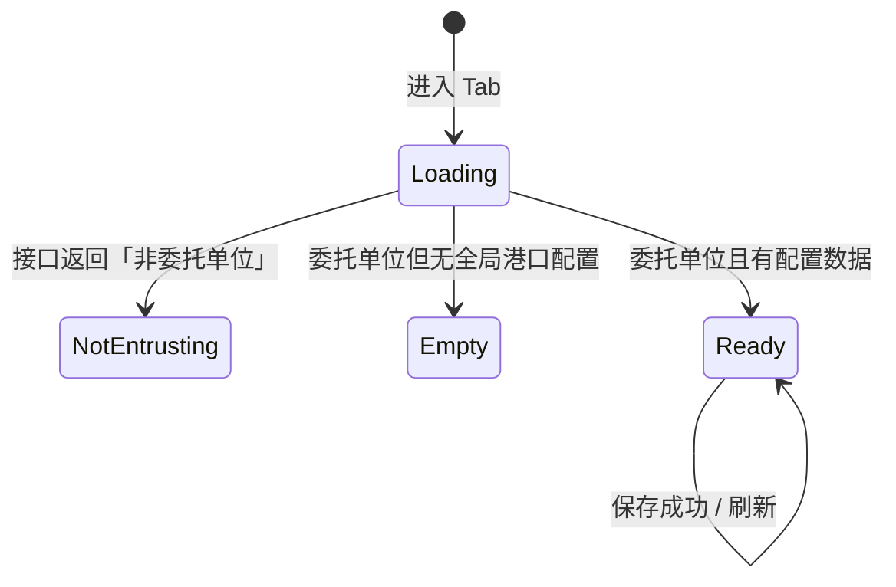

# 客户「海运出口服务项目」Tab PRD（测试版）

> **模块名称：** 客户编辑 — 海运出口服务项目（委托单位排除项）  
> **页面路径：** `/clients/:id/edit` → Tab「海运出口服务项目」  
> **菜单入口：** 客户管理 → 客户列表 → 双击/编辑进入客户编辑页 → 切换 Tab  
> **权限标识：** `Admin.Client`（与客户编辑页共用，无独立 Tab 权限）  
> **文档版本：** v1.0  
> **更新日期：** 2026-05-30  
> **参考文档：** `apps/web-antd/doc/modules/clients/id-edit.md`  
> **关联模块：** 基础资料「港口服务项配置」[`se-service-config-prd.md`](./se-service-config-prd.md)（全局模板，本 Tab 的数据来源之一）

---

## 1. 产品概述

### 1.1 业务背景

在**委托单位**客户资料中，按**起运港**维护该客户需要**排除**的海运出口服务项。

- 全局服务项模板在 **基础资料 → 港口服务项配置**（`/basic-data/se-service-config`）按起运港定义「有哪些服务项、默认规则是什么」。
- 本 Tab 在全局模板之上，为**单个委托单位**勾选「不启用」的服务项；关闭开关 = 该客户在该港口**排除**该服务项。
- 排除结果写入 `ClientExceptService`，供海运出口业务下单/任务执行时按客户过滤服务项。

### 1.2 与「港口服务项配置」的区别

| 维度 | 基础资料 · 港口服务项配置 | 客户编辑 · 海运出口服务项目 |
| --- | --- | --- |
| 路径 | `/basic-data/se-service-config` | `/clients/:id/edit`（Tab） |
| 配置对象 | 起运港（租户级模板） | 委托单位客户 |
| 可编辑内容 | 服务项类型、角色、开关、字段规则、排序等 | **仅「启用」开关**（排除/不排除） |
| 权限 | `Admin.ServiceConfig.SeServiceConfig` | `Admin.Client` |
| 适用客户 | 全部（模板不区分客户） | 仅 `industryCategories` 含 `p`（委托单位） |

### 1.3 核心价值

| 维度     | 说明                                               |
| -------- | -------------------------------------------------- |
| 配置粒度 | 客户 × 起运港 × 服务项（在全局模板范围内排除）     |
| 使用场景 | 某委托单位在特定起运港不需要订舱/拖车等部分服务    |
| 下游影响 | 该客户海运出口单据生成服务任务时，被排除项不应出现 |

### 1.4 不在本 Tab 范围内

- 不能新增/删除服务项类型（只能开关已有模板项）
- 不能修改用户属性、自动完成、字段展示/锁定/必填（只读展示，改模板请去基础资料）
- 非委托单位客户不可配置（仅提示，无表格）
- 新建客户页（`/clients/create`）**无**此 Tab，须先保存客户再进入编辑页

---

## 2. 目标用户与权限

### 2.1 角色

| 角色             | 典型操作                                        |
| ---------------- | ----------------------------------------------- |
| 客户资料维护人员 | 为委托单位客户配置各港口排除项                  |
| 普通查看者       | 有 `Admin.Client` 时可进入 Tab 查看（委托单位） |

### 2.2 权限点

| 权限           | 说明                         |
| -------------- | ---------------------------- |
| `Admin.Client` | 进入客户列表、编辑页及本 Tab |

**测试前置：** 准备具备 `Admin.Client` 的账号；另准备无客户权限账号验证拦截。

---

## 3. 功能清单

| #   | 功能                    | 入口                               | 优先级 |
| --- | ----------------------- | ---------------------------------- | ------ |
| F1  | Tab 切换与展示          | 客户编辑页顶部 Tab 栏              | P0     |
| F2  | 委托单位校验            | 进入 Tab 自动加载                  | P0     |
| F3  | 按起运港分组展示服务项  | Tab 内容区 Card + Table            | P0     |
| F4  | 启用开关（排除/不排除） | 表格最右列 Switch                  | P0     |
| F5  | 保存排除配置            | 右上角「保存」                     | P0     |
| F6  | 刷新                    | 右上角「刷新」                     | P1     |
| F7  | 只读展示模板字段        | 服务项、用户属性、三个开关列、备注 | P1     |

---

## 4. 页面结构

### 4.1 入口与路由

| 项目     | 值                                          |
| -------- | ------------------------------------------- |
| 列表路由 | `/clients`                                  |
| 编辑路由 | `/clients/:id/edit`（`:id` 为 GUID）        |
| Tab 键   | `exceptService`                             |
| Tab 文案 | 海运出口服务项目                            |
| 组件     | `src/views/client/except-service/index.vue` |
| 容器     | `src/views/client/editor.vue`               |

**进入方式：** 客户列表勾选/双击 → 编辑页 → 点击「海运出口服务项目」Tab。

### 4.2 页面状态（三种）



| 状态 | 展示 | 触发条件 |
| --- | --- | --- |
| 加载中 | 全页 Spin | `GetClientExceptServicesAsync` 请求中 |
| 非委托单位 | 黄色 Warning Alert | 后端错误信息含「非委托单位」 |
| 无全局配置 | Empty「暂无海运出口港口服务项配置」 | 委托单位但 `portGroups` 为空 |
| 正常配置 | 提示文案 + 刷新/保存 + 按港口 Card 列表 | 有分组数据 |

### 4.3 非委托单位提示

| 文案键 | 界面文案 |
| --- | --- |
| `seaExport.client.exceptService.notEntrustingUnit` | 非委托单位无服务项目设置 |

**判定口径（后端）：** 客户 `industryCategories` 字符串须包含字符 `p`（委托单位）。前端不单独解析，以接口成功/「非委托单位」错误为准。

**测试数据：** 在客户基础信息「行业类别」中勾选「委托单位」（值为 `p`），保存后再测本 Tab。

### 4.4 正常态布局

**顶部操作区：**

| 元素     | 说明                                                          |
| -------- | ------------------------------------------------------------- |
| 左侧提示 | 「关闭开关表示排除该服务项」                                  |
| 刷新     | 重新请求 `GetClientExceptServicesAsync`                       |
| 保存     | 提交 `EditClientExceptServicesAsync`，成功后 toast + 自动刷新 |

**内容区：** 每个起运港（含默认港口配置）一张 `Card`。`polId` 为空时标题显示「默认港口配置」；有值时标题为港口名称（`portName / cnName` 或回退 `polId`）。

**表格列（只读 + 最后一列可编辑）：**

| 列名 | 字段 | 展示规则 |
| --- | --- | --- |
| 服务项 | `serviceType` | 枚举文案（订舱、拖车等），与海运出口主流程共用 `ServiceType` |
| 用户属性 | `userAttribute` | 位标志解析为「销售、操作」等，多选用「、」连接；无则 `-` |
| 自动完成 | `autoComplete` | 是 / 否 |
| 允许手动完成 | `manualAllowed` | 是 / 否 |
| 完成提醒 | `reminder` | 是 / 否 |
| 备注 | `remark` | 文本或 `-` |
| 启用 | `isChecked` | **Switch**，可切换 |

---

## 5. 业务规则（测试重点）

### 5.1 `isChecked` 语义（易混淆）

| `isChecked`       | 界面含义                   | 保存行为                    |
| ----------------- | -------------------------- | --------------------------- |
| `true`（开关开）  | **启用**该服务项（不排除） | **不**写入排除列表          |
| `false`（开关关） | **排除**该服务项           | 写入该港口的 `serviceTypes` |

> **保存 payload 中的 `serviceTypes` = 被排除的服务项类型列表**，不是「启用列表」。

### 5.2 保存规则

| 规则 ID | 规则描述 |
| --- | --- |
| R-01 | 仅委托单位可保存；非委托单位保存按钮逻辑上不展示表格（`isEntrustingUnit=false`） |
| R-02 | 保存时仅提交 `isChecked === false` 的 `serviceType` |
| R-03 | 按港口分组：某港口若**没有任何**被排除项，则**不传**该港口对象 |
| R-04 | 若所有港口均无排除项，可传 `poLs: []`，会**清空**该客户全部排除记录 |
| R-05 | 具体港口的 `polId` 统一为字符串提交，避免大整数精度丢失 |
| R-06 | 本 Tab **不能**编辑模板字段（用户属性、三个布尔、备注）；变更须改基础资料后刷新本页 |
| R-07 | 默认港口配置分组 `polId` 为空，保存排除项时传 `polId: null` |

### 5.3 数据来源（后端合并逻辑，测试需知）

展示列表 = **全局** `SeServiceConfig`（按起运港的服务项模板）+ **客户** `ClientExceptService`（已保存的排除记录）合并计算 `isChecked`。

| 场景 | 期望 |
| --- | --- |
| 基础资料某港口有 3 个服务项 | 本 Tab 该港口表格 3 行 |
| 客户从未配置排除 | 默认全部 `isChecked=true`（开关全开） |
| 客户曾排除「订舱」 | 订舱行 `isChecked=false`（开关关） |
| 基础资料删除某服务项 | 刷新后该行不再出现（以后端为准） |
| 基础资料无任何港口配置 | Empty「暂无海运出口港口服务项配置」 |
| 基础资料有默认港口配置（`polId` 为空） | 出现标题为「默认港口配置」的 Card |
| 客户排除默认配置中的「订舱」 | 默认 Card 中订舱行 `isChecked=false`；保存后 `poLs` 含 `{ polId: null, serviceTypes: [0] }` |

### 5.4 服务项类型枚举

与海运出口、基础资料共用 `ServiceType`（`loadSeServiceTypeOptions()`）：

| 值  | 默认文案 |
| --- | -------- |
| 0   | 订舱     |
| 1   | 拖车     |
| 2   | 报关     |
| 3   | 仓库     |
| 4   | 保险     |
| 5   | 代收支   |

### 5.5 用户属性（只读展示）

与海运出口订单一致，共 6 项：销售、商务、操作、客服、单证、海外客服（不含财务、人事）。

---

## 6. 接口清单

**API 前缀：** `/services/app/ClientExceptServiceAdmin`

| 接口 | 方法 | 用途 |
| --- | --- | --- |
| `GetClientExceptServicesAsync?id=` | GET | 加载某客户按港口分组的服务项及 `isChecked` |
| `EditClientExceptServicesAsync` | PUT | 保存排除配置 |

### 6.1 查询

```
GET .../GetClientExceptServicesAsync?id={clientId}
```

**响应结构（简化）：**

```json
[
  {
    "polId": null,
    "pol": null,
    "items": [
      {
        "id": "yyy",
        "serviceType": 0,
        "userAttribute": 3,
        "autoComplete": false,
        "manualAllowed": true,
        "reminder": false,
        "remark": "",
        "sortId": 0,
        "isChecked": true
      }
    ]
  },
  {
    "polId": "10001",
    "pol": { "id": "10001", "portName": "CNSHA", "cnName": "上海" },
    "items": [
      {
        "id": "xxx",
        "serviceType": 0,
        "userAttribute": 3,
        "autoComplete": false,
        "manualAllowed": true,
        "reminder": false,
        "remark": "",
        "sortId": 0,
        "isChecked": true
      }
    ]
  }
]
```

### 6.2 保存

```json
{
  "clientId": "guid",
  "poLs": [
    {
      "polId": null,
      "serviceTypes": [0]
    },
    {
      "polId": "10001",
      "serviceTypes": [1, 2]
    }
  ]
}
```

说明：`serviceTypes` 为**被排除**的类型值；上例表示默认配置排除订舱(0)，上海港排除拖车(1)、报关(2)。

---

## 7. 测试用例（建议）

### 7.1 入口与权限

| 用例 ID | 步骤                              | 期望结果                    |
| ------- | --------------------------------- | --------------------------- |
| TC-001  | 无 `Admin.Client` 访问 `/clients` | 无菜单或 403                |
| TC-002  | 有权限进入编辑页                  | 可见「海运出口服务项目」Tab |
| TC-003  | 新建页 `/clients/create`          | **无**本 Tab（仅编辑页有）  |
| TC-004  | URL 无有效 clientId               | 提示「缺少客户ID」          |

### 7.2 委托单位校验

| 用例 ID | 步骤 | 期望结果 |
| --- | --- | --- |
| TC-101 | 客户未勾选委托单位（`industryCategories` 无 `p`） | 仅显示 Warning，无表格、无保存区 |
| TC-102 | 勾选委托单位并保存后进入 Tab | 正常加载或 Empty |
| TC-103 | 基础信息去掉委托单位后刷新 Tab | 变为非委托单位提示 |

### 7.3 展示与全局模板联动

| 用例 ID | 步骤 | 期望结果 |
| --- | --- | --- |
| TC-201 | 基础资料未配置任何起运港 | Empty「暂无海运出口港口服务项配置」 |
| TC-202 | 基础资料为港口 A 配置 3 项服务 | 本 Tab 出现 A 港 Card，3 行 |
| TC-203 | 基础资料为 A、B 两港配置 | 两个 Card，各自行数与模板一致 |
| TC-207 | 基础资料有默认港口配置 | 出现「默认港口配置」Card，行数与默认模板一致 |
| TC-204 | 检查服务项列 | 显示中文枚举名，非裸数字 |
| TC-205 | 检查用户属性/开关/备注列 | 与基础资料模板一致，**不可编辑** |
| TC-206 | 基础资料修改某服务项「自动完成」后刷新本 Tab | 只读列同步更新 |

### 7.4 开关与保存

| 用例 ID | 步骤 | 期望结果 |
| --- | --- | --- |
| TC-301 | 首次进入委托单位客户 | 默认全部开关**开启**（启用） |
| TC-302 | 关闭「订舱」开关后保存 | 成功提示；再进入订舱仍为关 |
| TC-303 | 关闭后重新打开并保存 | 订舱不再出现在排除列表 |
| TC-304 | A 港排除 2 项、B 港不排除 | 保存后仅 A 出现在 `poLs`；B 不传 |
| TC-308 | 默认配置排除「订舱」后保存 | `poLs` 含 `{ polId: null, serviceTypes: [0] }` |
| TC-305 | 全部开关打开后保存 | `poLs` 为空，清空历史排除 |
| TC-306 | 保存后不关页刷新 | 状态与库一致 |
| TC-307 | 点击刷新 | 丢弃未保存的开关改动，恢复服务端状态 |

### 7.5 边界与回归

| 用例 ID | 步骤 | 期望结果 |
| --- | --- | --- |
| TC-401 | 超大 `polId` 客户 | 港口标题正常显示，保存不丢精度 |
| TC-402 | 枚举接口失败时打开 Tab | 服务项列仍有兜底文案（订舱等） |
| TC-403 | 保存接口失败 | 错误提示，本地开关不当作已持久化 |
| TC-404 | 切换至其他 Tab 再返回 | 重新 `onMounted` 加载（非 KeepAlive 子页） |
| TC-405 | 非委托单位客户直接调保存 API | 后端拒绝（非委托单位） |

### 7.6 端到端（可选，需业务环境）

| 用例 ID | 步骤 | 期望结果 |
| --- | --- | --- |
| TC-501 | 客户 A 排除「订舱」后创建海运出口单（同起运港） | 该客户服务任务不含订舱（以后端任务生成为准） |
| TC-502 | 未排除项 | 仍按全局模板生成任务 |

---

## 8. 验收标准（Must Have）

1. **委托单位门禁：** 非委托单位仅提示，不展示可编辑表格。
2. **模板驱动：** 表格行集与基础资料「港口服务项配置」一致，不能凭空增删服务项类型。
3. **开关语义正确：** 关 = 排除，开 = 启用；保存 payload 只含排除项。
4. **持久化：** 保存后刷新/重进 Tab，开关状态与库一致。
5. **清空排除：** 全部开启并保存后，该客户无排除记录。
6. **只读列：** 用户属性、自动完成等不可在本 Tab 修改。
7. **枚举文案：** 服务项类型显示中文，与海运出口模块一致。
8. **权限：** 无客户权限不可操作。

---

## 9. 已知风险与测试关注点

| 风险点 | 说明 | 测试建议 |
| --- | --- | --- |
| `isChecked` 与 `serviceTypes` 反向 | 保存的是排除列表 | 重点 TC-302~305 |
| 依赖全局模板 | 无 `SeServiceConfig` 则 Empty | 先配基础资料再测客户 Tab |
| 委托单位判定在后端 | 前端仅识别错误文案「非委托单位」 | 改行业类别后需保存客户再测 |
| 空 `poLs` 清空 | 全开保存会删除历史排除 | TC-305 单独验证 |
| 与基础资料 PRD 混淆 | 两套页面、两套 API | 测试用例注明路径与权限 |

---

## 10. 测试数据建议

| 数据项   | 建议                                                |
| -------- | --------------------------------------------------- |
| 客户 C1  | 委托单位（`industryCategories` 含 `p`），用于主流程 |
| 客户 C2  | 非委托单位，用于门禁                                |
| 起运港   | 至少在基础资料配置 A、B 两港，每港 2~3 个服务项     |
| 排除样例 | C1 + A 港排除订舱(0)、拖车(1)                       |
| 账号     | 具备 `Admin.Client` 的用户                          |

**推荐测试顺序：**

1. 基础资料配置港口 A 服务项模板
2. 创建/编辑客户 C1 为委托单位
3. 进入 `/clients/{C1}/edit` → 海运出口服务项目 Tab
4. 执行开关与保存用例
5. （可选）海运出口下单验证任务过滤

---

## 11. 附录：关键源码索引

| 文件 | 职责 |
| --- | --- |
| `src/views/client/editor.vue` | Tab 容器与路由 `:id` |
| `src/views/client/except-service/index.vue` | 页面 UI、加载、保存 |
| `src/views/client/except-service/data.ts` | `buildEditPayload`、`isNotEntrustingUnitApiError` |
| `src/api/sea-export/client-except-service-admin.ts` | API 封装 |
| `src/views/sea-export-admin/service-type.ts` | `ServiceType` 枚举加载 |
| `doc/prd/se-service-config-prd.md` | 全局模板 PRD（配对阅读） |
