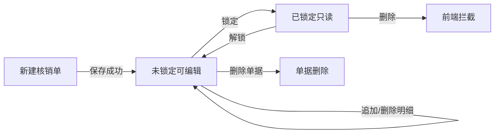

# 收费核销业务逻辑说明

> **菜单入口：** 费用管理 → 收费核销  
> **列表路径：** `/settlement-management/receive-settlement`  
> **按开票新建示例：** `/settlement-management/receive-settlement/add-by-invoice?bankStatementId=83744d2c-1588-46c1-8c45-bb6df7ecf080`  
> **权限标识：** `Admin.ReceiveSettlement`  
> **关联文档：** [模块活文档](../modules/settlement-management/receive-settlement.md)、[银行流水工作台](./bank-statement-edit-prd.md)、[核销抽屉](./bank-statement-drawer-prd.md)

---

## 1. 业务一句话

收费核销把**银行流水（实际到账）**与**应收/应付费用占用**关联起来：财务选定一条流水，再按「费用」或「开票申请」勾选明细并录入本次结算金额，生成核销单；单据可锁定。两种方式共用同一条费用已结算池，列表/汇总按**净额**（收正付负）展示。

---

## 2. 两种核销方式

| 对比项 | 按费用（type=0） | 按开票申请 / 发票结算（type=1） |
| :-- | :-- | :-- |
| 业务含义 | 直接按订单费用剩余额度核销 | 按已开票申请明细、发票口径余额核销 |
| 新建路由 | `/receive-settlement/add` | `/receive-settlement/add-by-invoice` |
| 编辑路由 | `/receive-settlement/edit/:id` | `/receive-settlement/edit-by-invoice/:id` |
| 页面组件 | `form.vue` | `invoice-form.vue` |
| 选明细抽屉 | `add-fee-drawer`（按业务/委托分组） | `add-invoice-application-drawer`（按开票申请分组） |
| 新建接口 | `AddAsync` | `AddByInvoiceApplicationAsync` |
| 追加明细 | `AddItemsAsync` | `AddItemsByInvoiceApplicationAsync` |
| 删除明细 | `DeleteItemsAsync` | `DeleteInvoiceItemsAsync` |
| 本单占用流水口径 | 明细金额合计（毛额相加） | **净额** Σ `toNetAmount(paySide, amount)` |
| 列表类型文案 | 按业务 | 按开票申请 |

**类型不可混：** 列表双击、银行流水抽屉编辑必须按 `row.type` 进入对应表单；对 type=0 调按开票追加接口会被后端拒绝。

---

## 3. 页面与入口地图

```text
费用管理 → 收费核销列表
├─ Tab「收费核销」
│   ├─ 新建下拉 → 费用结算 → /add[?bankStatementId]
│   ├─ 新建下拉 → 发票结算 → /add-by-invoice[?bankStatementId]
│   └─ 双击行 → 按 type 进 /edit/:id 或 /edit-by-invoice/:id
│       （已锁定仍可进，页面只读）
└─ Tab「银行流水」
    ├─ 勾选一条流水 + 新建下拉 → 带 bankStatementId 跳转
    └─ 双击流水行 → 默认按费用新建（带 bankStatementId）

财务管理 → 银行流水编辑（工作台）
└─ 右侧抽屉新增/编辑核销（不跳独立路由，嵌入同一套 form）
   详见 bank-statement-drawer-prd.md
```

### 3.1 Query 预填 `bankStatementId`

| 场景 | 行为 |
| :-- | :-- |
| 列表查询区已选流水后点「新建」 | 新建页 query 带入该流水并预填 |
| 访问 `/add?bankStatementId=xxx` 或 `/add-by-invoice?bankStatementId=xxx` | 加载流水详情，展示「银行流水信息」Card |
| 访问列表 `?bankStatementId=xxx` | 查询区预填该流水并触发查询 |
| 银行流水 Tab 选中后新建 | 必须只选一条；多选提示「每次只能针对一条」 |

示例（用户给出的路径）：

```text
/settlement-management/receive-settlement/add-by-invoice
  ?bankStatementId=83744d2c-1588-46c1-8c45-bb6df7ecf080
```

含义：在指定银行流水上**新建按开票申请核销单**；页面打开后应已选中该流水，并展示流水金额、已结算、剩余可结算。

---

## 4. 列表页结构

### 4.1 Tab「收费核销」

- 查询：结算单号、结算时间范围、创建人、银行流水（`BankStatementSelect`，权限过滤接口）。
- 列含：结算单号、**结算类型**、结算状态、结算时间、银行流水号、**结算净额**、明细条数、锁定、创建人、备注等。
- 交互：勾选 + 顶部操作；**无操作列**；双击进编辑；批量删除遇锁定行整批拦截。
- 「新建」为悬浮下拉：费用结算 / 发票结算；主按钮默认费用结算。

### 4.2 Tab「银行流水」

- 与 `/bank-statement` 列表字段对齐（含已结算金额、核销状态筛选）。
- 接口：`BankStatement/GetPagedListAsync`（按当前用户操作人权限过滤）。
- 「新建」同样下拉分流到 `/add` 或 `/add-by-invoice`。

### 4.3 结算状态（只读 Tag）

| 值  | 文案     |
| :-- | :------- |
| 0   | 录入中   |
| 1   | 审核中   |
| 2   | 已驳回   |
| 3   | 审核通过 |
| 4   | 部分结算 |
| 5   | 已结算   |

前端**不提供**审核或状态流转按钮；`status` 仅展示。

---

## 5. 表单页共用骨架（费用 / 发票）

```text
┌─ 标题栏 ─────────────────────────────────────────────┐
│ 新建/编辑/查看…          [返回|关闭] [保存] [锁定…]   │
├─ 银行流水信息 Card（选中流水后）──────────────────────┤
│ 流水号/交易时间/金额/币别/付款方/银行…                │
│ 已结算(不含本单) | 剩余可结算 | 本单本次合计(或净额)   │
├─ 结算信息 ───────────────────────────────────────────┤
│ 银行流水 | 结算单号 | 创建人 | 结算时间 | 状态 | 备注 │
├─ 结算明细 ───────────────────────────────────────────┤
│ [添加明细] [删除] + 表格勾选                          │
└──────────────────────────────────────────────────────┘
右侧抽屉：选费用 / 选开票申请明细
```

### 5.1 银行流水摘要计算

| 指标 | 计算 |
| :-- | :-- |
| 已结算（不含本单） | 该流水下其他核销单 `totalSettledAmount` 之和（编辑排除当前单） |
| 本单本次合计 | type=0：明细 `settledAmount` 求和；type=1：按收付换算净额求和 |
| 剩余可结算 | 流水 `amount` − 已结算（不含本单）− 本单本次合计 |

- 数据：并行拉流水详情 + 关联核销列表（`pageSize=500`）。
- 权限侧用 `BankStatement/DetailAsync`、`GetReceiveSettlementPagedListAsync`（按操作人过滤），与 Admin 编辑页接口职责分离。
- 剩余 &lt; 0 时标红；保存前端阻断。

### 5.2 结算信息字段

| 字段            | 新建        | 编辑 | 只读 | 规则                 |
| :-------------- | :---------- | :--- | :--- | :------------------- |
| 银行流水        | Picker 可选 | 只读 | 只读 | **有明细后不可更换** |
| 结算单号        | —           | 文本 | 文本 | 后端生成             |
| 结算时间        | 默认可改    | 可改 | 只读 | 必填                 |
| 结算状态 / 锁定 | —           | Tag  | Tag  | 只读展示             |
| 备注            | 可改        | 可改 | 只读 |                      |

编辑保存主表仅 `EditAsync`：`id` + `orgId` + `settlementTime` + `remark`（`orgId` 只读回传）。

### 5.3 锁定

| 动作 | 接口 | 效果 |
| :-- | :-- | :-- |
| 锁定 | `LockAsync` | 只读：隐藏保存/删除/添加明细/勾选删除；标题变为「查看…」 |
| 解锁 | `UnLockAsync` | 恢复可编辑 |
| 已锁定进页 | — | 仍可从列表/工作台打开，不是 404 |

---

## 6. 按费用核销（type=0）详述

### 6.1 选费抽屉

| 筛选项              | 说明                               |
| :------------------ | :--------------------------------- |
| 结算对象            | **只读**，随流水付款方带出         |
| 币别                | **只读**，与流水 `currencyId` 一致 |
| 委托编号 / 主提单号 | 可选模糊                           |

- 按运输业务分组展开费用行；默认「本次结算金额」= 费用剩余额度。
- 输入金额自动勾选；已在主表明细的费用不可再选。
- 新建态确认后追加本地；编辑态即时 `AddItemsAsync`。

### 6.2 校验（保存前）

| 规则           | 说明                                          |
| :------------- | :-------------------------------------------- |
| 必填           | 银行流水、结算时间、至少 1 条明细（新建）     |
| 金额 &gt; 0    | 每条本次结算金额                              |
| 不超过费用剩余 | 未保存明细：`settledAmount ≤ remainingAmount` |
| 不超过流水剩余 | 本单合计不得使「剩余可结算」&lt; 0            |
| 费用不重复     | 同一 `orderFeeId` 不可重复                    |

### 6.3 明细维护特点

- **已保存明细金额不可改**（后端无改单条金额接口）；调整须先删后加。
- 删除：勾选行 + 工具栏「删除」→ `DeleteItemsAsync`。

---

## 7. 按开票申请核销（type=1）详述

对应路由：`/add-by-invoice`、`/edit-by-invoice/:id`。

### 7.1 选开票抽屉

| 筛选项                | 说明                                         |
| :-------------------- | :------------------------------------------- |
| 结算对象 / 币别       | 随流水固定（只读）                           |
| 开票申请单号 / 发票号 | 可选                                         |
| 申请时间范围          | 可选                                         |
| **仅显示可结算**      | `onlySettleable`：只看发票口径仍有余额的明细 |

- 一组 = 一张**已开票**开票申请；展开后勾选费用明细。
- 展示：收付方向、本单开票额、**发票可结算余额** `invoiceSettleableAmount`。
- 发票口径余额口径：`max(0, 已开票 − 已结算)`（与费用结算池共用已结算）。
- 确认后：新建追加本地；编辑即时 `AddItemsByInvoiceApplicationAsync`。

### 7.2 净额占用流水

```text
toNetAmount(paySide, amount) =
  应收(paySide=0) → +amount
  应付(paySide=1) → −amount

本单本次净额 = Σ toNetAmount(...)
剩余可结算   = 流水金额 − 其他单净额合计 − 本单本次净额
```

列表/详情字段 `totalSettledAmount` 亦为净额（跨费用子表与开票子表现算，不落库净额字段）；落库仍是各明细毛额。

### 7.3 校验（保存前）

| 规则 | 说明 |
| :-- | :-- |
| 与费用单相同的主表必填 | 流水、时间、明细非空 |
| 金额 &gt; 0 | 每条毛额 |
| **按 orderFeeId 聚合** | 未保存明细对同一费用的本次结算合计 ≤ 该费用发票可结算余额（多张开票申请可能含同一费用，前端按共享池聚合） |
| 净额不超流水剩余 | 同上「剩余可结算」 |

最终以后端悲观锁 + 双口径校验为准；前端聚合仅为提前拦截。

### 7.4 明细列（发票单）

开票申请单号、发票号、委托/主提单、费用名称、**收付**、币别、费用总额、发票可结算余额、本次结算金额、结算对象、备注等。

删除走 `DeleteInvoiceItemsAsync`（入参为开票明细则 ID 列表，不是费用明细则）。

---

## 8. 共用已结算池（跨类型卡点）

```text
OrderFee.SettledAmount（已结算）
        ↑
   ┌────┴────┐
type=0 按费用   type=1 按开票
（互占同一池，一种占用后另一种可用额度下降）
```

| 口径           | 含义                                    |
| :------------- | :-------------------------------------- |
| 费用剩余额度   | 费用总额 − 已结算（按费用结算抽屉用）   |
| 发票可结算余额 | max(0, 已开票 − 已结算)（按开票抽屉用） |

测试时需构造：同一费用先被 type=0 占用一部分，再开 type=1，确认余额联动。

---

## 9. 状态与生命周期



- 新建成功：独立路由 `replace` 到对应编辑页；嵌入抽屉模式则关抽屉并通知父页刷新。
- 编辑增删明细：即时调接口，不攒到主表保存。
- 流水核销状态（待核销/部分/完成）由银行流水侧汇总核销净额驱动，见 [银行流水工作台](./bank-statement-edit-prd.md)。

---

## 10. 权限矩阵

| 权限                                      | 作用                        |
| :---------------------------------------- | :-------------------------- |
| `Admin.ReceiveSettlement.Get`             | 列表、编辑/只读页           |
| `Admin.ReceiveSettlement.Add`             | 新建（含费用/发票两种入口） |
| `Admin.ReceiveSettlement.Edit`            | 主表保存、增删明细          |
| `Admin.ReceiveSettlement.Delete`          | 删单、列表批量删            |
| `Admin.ReceiveSettlement.Lock` / `Unlock` | 锁定 / 解锁                 |

银行流水选择器、摘要接口走用户有权查看的流水（操作人配置过滤），与 Admin 全量列表不同。

---

## 11. 核心接口

| 接口 | 用途 |
| :-- | :-- |
| `ReceiveSettlementAdmin/GetPagedListAsync` | 核销列表 |
| `ReceiveSettlementAdmin/DetailAsync` | 详情（含 `type`、两套子表） |
| `ReceiveSettlementAdmin/AddAsync` | 按费用新建 |
| `ReceiveSettlementAdmin/AddByInvoiceApplicationAsync` | 按开票新建 |
| `ReceiveSettlementAdmin/EditAsync` | 改结算时间/备注，并回传 `orgId` |
| `ReceiveSettlementAdmin/AddItemsAsync` / `DeleteItemsAsync` | 费用明细增删 |
| `ReceiveSettlementAdmin/AddItemsByInvoiceApplicationAsync` / `DeleteInvoiceItemsAsync` | 开票明细增删 |
| `ReceiveSettlementAdmin/LockAsync` / `UnLockAsync` / `DeleteAsync` | 锁定/解锁/删单 |
| `ReceiveSettlementAdmin/GetOrderFeeGroupAsync` | 选费 |
| `ReceiveSettlementAdmin/GetInvoiceApplicationGroupForSettlementAsync` | 选开票 |
| `BankStatement/.../DetailAsync` 等 | 流水摘要与关联单汇总 |

### 11.1 按开票新建请求体示例

```json
{
  "bankStatementId": "83744d2c-1588-46c1-8c45-bb6df7ecf080",
  "settlementTime": "2026-07-17T04:00:00.000Z",
  "remark": "",
  "items": [
    {
      "invoiceApplicationItemId": "guid",
      "settledAmount": 1000.0,
      "remark": ""
    }
  ]
}
```

### 11.2 按费用新建请求体示例

```json
{
  "bankStatementId": "guid",
  "settlementTime": "2026-07-17T04:00:00.000Z",
  "remark": "",
  "receiveSettlementItems": [
    {
      "orderFeeId": "guid",
      "settledAmount": 1000.0,
      "remark": ""
    }
  ]
}
```

---

## 12. 业务卡点与易错点

1. **明细金额不能编辑** — 只能删后重加；勿报「无法改本次结算金额」为缺陷（产品设计）。
2. **选费筛选项有限** — 无费用代码/ETD/组织等筛选；勿当漏功能。
3. **类型路由必须正确** — 发票单进 `/edit` 会明细为空；费用单进 `/edit-by-invoice` 同理。
4. **净额 vs 毛额** — 发票单占用流水看净额；落库与录入仍是正数毛额 + 收付方向。
5. **双类型共用已结算池** — 测交叉占用；同一 `orderFeeId` 出现在多张开票申请时前端聚合校验。
6. **流水摘要 pageSize=500** — 单流水下核销单极多时「已结算」可能不准，需大数据量关注。
7. **嵌入模式 ID** — 银行流水抽屉内必须用 `embeddedId`（核销单 ID），勿读流水路由 `:id`。
8. **status 不可操作** — 仅 Tag；勿测页面改状态。

---

## 13. 建议验收场景

| # | 场景 | 期望 |
| :-- | :-- | :-- |
| 1 | 打开 `add-by-invoice?bankStatementId=…` | 流水已预填，摘要 Card 有金额与剩余 |
| 2 | 按开票勾选含应收+应付明细并保存 | 成功跳转 `edit-by-invoice/:id`；净额与流水剩余正确 |
| 3 | 本单净额 &gt; 流水剩余 | 剩余标红；保存拦截 |
| 4 | 同一费用发票余额不足（多申请聚合） | 保存前提示可用额度 |
| 5 | 列表双击 type=1 行 | 进入发票编辑页，明细有值 |
| 6 | 按费用建单后再按开票核同一费用 | 开票可结算余额已减少 |
| 7 | 锁定后双击进入 | 「查看…」；无保存/添加明细 |
| 8 | 银行流水工作台抽屉新建发票核销 | 关抽屉后工作台已核销/剩余刷新（见抽屉 PRD） |
| 9 | 有明细后尝试换流水 | 提示不可更换 |
| 10 | 编辑态删开票明细 | 走 `DeleteInvoiceItemsAsync`，汇总刷新 |

---

## 14. 测试数据建议

| 数据项 | 建议 |
| :-- | :-- |
| 银行流水 | 无核销 / 部分核销各至少 1 条；金额与币别明确 |
| 应收费用 | 同付款方、同币别，剩余 &gt; 0 |
| 开票申请 | 已开票；含应收与应付明细；最好含同一费用出现在两张申请中的边界数据 |
| 交叉核销 | 先 type=0 占一部分，再测 type=1 |
| 账号 | 全权限 / 无 Add / 无 Edit / 无 Lock |

---

## 15. 源码索引

| 文件 | 职责 |
| :-- | :-- |
| `router/.../fee-management.ts` | 列表与 add/edit/add-by-invoice/edit-by-invoice 路由 |
| `receive-settlement/list.vue` | 双 Tab 容器 |
| `receive-settlement-grid.vue` | 核销列表与新建下拉 |
| `bank-statement-grid.vue` | 银行流水 Tab 与带流水新建 |
| `form.vue` | 按费用表单（含 embedded） |
| `invoice-form.vue` | 按开票表单（含 embedded） |
| `add-fee-drawer/` | 选费 |
| `add-invoice-application-drawer/` | 选开票 |
| `form-data.ts` | 状态/类型/收付文案、`toNetAmount` |
| `api/.../receive-settlement-admin.ts` | 全部核销 API |

---

## 16. 与旧版 PRD 差异（相对 2026-06-14）

| 旧版 | 现版 |
| :-- | :-- |
| 仅「收费结算」按费用一条链路 | 正式「收费核销」+ **按开票申请**完整链路 |
| 菜单在结算管理表述 | 侧栏在「费用管理」，URL 仍为 `/settlement-management/receive-settlement` |
| 未写净额/双类型共用池 | 专节说明净额、共享已结算池、类型分流 |
| 未写银行流水工作台抽屉 | 交叉引用工作台与抽屉 PRD；独立路由与嵌入模式并存 |
