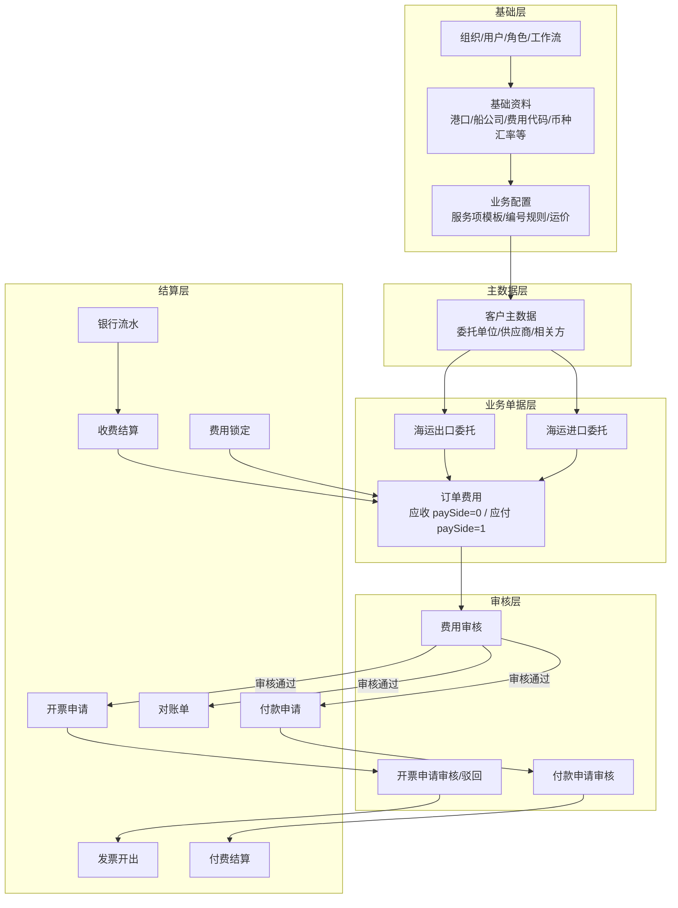

# 1. 系统业务全景

货代系统前端（`web-antd`）围绕 **委托单（运输单）** 展开：先维护基础资料与客户，再创建海运出口/进口委托，在编辑工作台完成服务执行与费用维护，经审核后进入 **应收（开票 + 收费结算）** 与 **应付（付款申请 + 付费结算）** 两条财务链路。



---

# 2. 核心业务流程说明

## 2.1 海运出口主流程（P0）

| 步骤 | 角色 | 模块/路由 | 说明 |
| :-- | :-- | :-- | :-- |
| 1 | 基础数据管理员 | `/basic-data/*` | 维护港口、船公司、费用代码、服务项模板等 |
| 2 | 销售/操作 | `/clients` | 维护委托单位、发货人、订舱代理等客户 |
| 3 | 销售 | `/sea-exports/create` | 选委托单位、起运港 → 联动服务项 → 填干系人/船期/箱货 → 保存 |
| 4 | 操作/各服务角色 | `/sea-exports/:id/edit` | 服务流水线完成任务；维护派车、分单 |
| 5 | 商务/财务 | 编辑页「应收应付」Tab | 录入应收/应付费用 |
| 6 | 财务主管 | `/audit-approval/expense-review` 或工作台 | 费用提交审核 → 通过/驳回 |
| 7a 应收 | 财务 | `/fee-management/invoice-application` | 选已审核应收费用 → 开票申请 → 提交 |
| 7b 应收 | 财务 | `/fee-management/invoice-issue` | 对已提交开票申请执行开票 |
| 7c 应收 | 财务 | `/bank-statement` → `/settlement-management/receive-settlement` | 登记银行流水 → 收费结算勾应收费用 |
| 8 应付 | 财务 | `/fee-management/payment-application/add` | 选已审核应付费用 → 付款申请 |
| 9 应付 | 财务主管 | `/audit-approval/payment-review` | 付款申请审核 |
| 10 应付 | 财务 | `/settlement-management/payment-settlement` | 对已审核付款申请执行付费结算 |

**费用状态流转（订单费用）：**

```
录入(0) → 提交审核(1) → 审核通过(2) → 部分结算(6) → 结算完毕(7)
              ↓ 驳回(3) → 可再编辑
审核通过后 → 申请修改(4) / 申请删除(5) → 费用审核任务处理
```

**开票申请状态（独立实体）：**

```
录入 → 提交审核(Auditing，已提交即可开票) → 已开票(Invoiced)
         ↑ 撤回                    ↓ 仅驳回
         └──────────────── Rejected（可修改再提交）
```

## 2.2 工作台并行入口

路由 `/workspace` 聚合三类任务：

- **海运出口服务**：按起运港 + 服务项（订舱/拖车/报关等）看待处理委托
- **应收应付审核**：费用审核任务列表
- **付费申请审核**：付款申请审核任务列表

依赖：`/basic-data/se-service-config` 为起运港配置服务项模板；干系人角色须与模板 `userAttribute` 对齐。

## 2.3 海运进口（P1，结构与出口类似）

路由 `/sea-imports/*`，编辑工作台同样含基础信息、费用、更改单等。测试数据可与出口共用基础资料与客户，单独准备 1~2 票进口委托即可。

## 2.4 辅助流程

| 流程 | 路由 | 用途 |
| :-- | :-- | :-- |
| 费用锁定 | `/fee-management/fee-lock` | 运输单维度锁费，锁后费用变更受限 |
| 对账单 | `/fee-management/statement` | 按对象/期间汇总费用做对账确认 |
| 运价管理 | `/freight-rate` | 维护航线运价，供报价/费用参考 |
| 客户排除服务项 | `/clients/:id/edit` → 海运出口服务项目 Tab | 委托单位按港口排除部分服务项 |
| 更改单 | 海出编辑页「更改单」Tab | 锁费后通过更改单变更费用 |

---

# 3. 测试数据创建顺序（推荐）

按依赖关系 **从下到上** 创建，避免联调时缺参照数据。

```
阶段 0  系统与组织（已有部分可跳过）
阶段 1  基础资料（字典类，一次建全）
阶段 2  业务配置（服务项模板、编号规则、运价）
阶段 3  客户主数据（多角色、多行业类别）
阶段 4  业务委托单（海出/海进 + 多状态费用）
阶段 5  财务单据（开票、付款、流水、结算）
阶段 6  边界/权限账号（只读、无 Lock 等）
```

---

# 4. 测试数据清单（逐项创建）

> **图例**：✅ 已有记录见 [`TEST_DATA_INDEX.md`](./TEST_DATA_INDEX.md)  
> **优先级**：P0 主流程必建 / P1 重要分支 / P2 边界与回归

---

## 阶段 0：系统与组织

| # | 数据项 | 优先级 | 数量建议 | 关键字段/要求 | 支撑场景 | 状态 |
| :-- | :-- | :-: | :-- | :-- | :-- | :-- |
| 0-1 | **公司组织** | P0 | ≥1 | 类型=公司；作为用户归属、银行账户挂载点 | 全模块组织树、所属公司 | ✅ 云东公司 |
| 0-2 | **下级部门** | P0 | ≥3 | 销售部/操作部/财务部 | 岗位分工、数据权限 | ✅ 云东三部门 |
| 0-3 | **公司银行账户** | P0 | ≥2 币种 | RMB + USD 至少；含开户行、账号、SWIFT | 付费结算、银行流水、收费结算 | ✅ 云东 4 币种 |
| 0-4 | **测试用户** | P0 | ≥4 | 销售/操作/财务/审核人；密码统一非生产 | 全流程角色切换 | ✅ yd_xiaoshou 等 3 人 |
| 0-5 | **审核人/主管账号** | P0 | 1 | 具备费用/付款审核权限 | 费用审核、付款审核 | ✅ `yd_shenhe` id=29 |
| 0-6 | **角色与权限** | P1 | 2~3 套 | 全权限管理员 / 业务只读 / 无 Lock 权限 | 权限边界 | ⬜ 待建 |
| 0-7 | **审批工作流** | P1 | 1~2 条 | 任务类型覆盖费用审核、付款申请审核 | 审核任务链路 | ⬜ 待建 |
| 0-8 | **编号规则** | P1 | 若干 | 委托编号、开票申请号、发票开出流水号等 | 建单/开票时自动生成编号 | ⬜ 待建 |

**创建入口**：`/system/dept`、`/system/user`、`/system/role`、`/system/workflow`、`/basic-data/generate-num`

---

## 阶段 1：基础资料（字典）

> 多数环境可能已有种子数据；以下列出 **业务联调最小集**，缺哪项补哪项。

| # | 数据项 | 优先级 | 数量建议 | 关键要求 | 支撑场景 | 状态 |
| :-- | :-- | :-: | :-- | :-- | :-- | :-- |
| 1-1 | **国家** | P1 | 若干 | CN、US 等 | 港口、客户地址 | ⬜ |
| 1-2 | **港口** | P0 | ≥3 | 至少 POL-A（如上海）、POL-B（未配服务项）、POD（目的港） | 海出建单、服务项联动、运价 | 🟢 复用（上海/青岛/天津等） |
| 1-3 | **航线** | P1 | ≥2 | 与港口关联 | 运价 Tab 筛选 | ⬜ |
| 1-4 | **船公司/承运人** | P0 | ≥2 | 含简称、Logo（可选） | 海出委托、运价 | ⬜ |
| 1-5 | **箱型** | P0 | ≥2 | 20GP、40HQ | 箱货、运价 | ⬜ |
| 1-6 | **币种** | P0 | ≥3 | RMB、USD、EUR | 费用、汇率、结算 | ⬜ |
| 1-7 | **汇率** | P0 | 每币种对 | USD→RMB、EUR→RMB 等有效汇率 | 跨币种费用/结算 | ⬜ |
| 1-8 | **费用名称 + 费用代码** | P0 | ≥5 | 区分应收/应付属性；含税率 | 订单费用录入 | ⬜ |
| 1-9 | **服务代码/运费代码/货物/包装/来源/签单方式** | P1 | 各 ≥1 | 海出表单下拉 | 委托单必填/选填项 | ⬜ |
| 1-10 | **发票商品编码** | P1 | ≥2 | 对接 `CodeInvoice` | 开票申请商品明细 | ⬜ |
| 1-11 | **附件类型** | P2 | ≥2 | 含默认展示模块 | 客户/委托附件 | ⬜ |
| 1-12 | **问题类型** | P2 | ≥1 | — | 问题记录 Tab（预留） | ⬜ |

**创建入口**：`/basic-data/*` 各子菜单

---

## 阶段 2：业务配置

| # | 数据项 | 优先级 | 数量建议 | 关键要求 | 支撑场景 | 状态 |
| :-- | :-- | :-: | :-- | :-- | :-- | :-- |
| 2-1 | **默认港口服务项配置** | P0 | 1 | `polId` 为空；含订舱(0)、拖车(1)、报关(2) 等 ≥3 项；绑定 userAttribute | 未单独配港口的起运港、客户排除服务 Tab | ⬜ |
| 2-2 | **起运港 A 专属服务项** | P0 | 1 | POL-A 已配置；顺序、展示/锁定/必填字段有差异 | 工作台服务任务、海出服务流水线 | ✅ 上海（见造数日志） |
| 2-3 | **起运港 B（未配置）** | P1 | — | 港口存在但无 `SeServiceConfig` | 空态提示「请先配置服务项」 | ⬜ |
| 2-4 | **运价** | P1 | ≥3 条 | 覆盖 POL-A + 船公司 + 箱型 + 航线 | 运价列表、商务参考 | ⬜ |
| 2-5 | **编号规则（业务）** | P1 | 2~3 | 海出委托号、InvoiceApplication、InvoiceIssue | 自动编号不报错 | ⬜ |

**创建入口**：`/basic-data/se-service-config`、`/freight-rate`、`/basic-data/generate-num`

---

## 阶段 3：客户主数据

| # | 数据项 | 优先级 | 行业类别 | 子资料要求 | 支撑场景 | 状态 |
| :-- | :-- | :-: | :-- | :-- | :-- | :-- |
| 3-1 | **委托单位 C-ENT** | P0 | `p` | 联系人 ≥1；付款条件（票结/月结）；发票信息 | 海出委托单位、应收结算对象 | ✅ YD-ENT |
| 3-2 | **委托单位 C-ENT-2** | P1 | `p` | 不同账期 | 应结日期、对账 | ⬜ |
| 3-3 | **发货人 C-SHP** | P0 | `b` | — | 海出相关方 | ✅ YD-SHP |
| 3-4 | **收货人 C-CNE** | P0 | `e` | — | 海出相关方 | ✅ YD-CNE |
| 3-5 | **通知人 C-NFY** | P1 | `h` | — | 海出相关方 | ⬜ |
| 3-6 | **订舱代理 C-BKG** | P0 | `o` | 作为应付结算对象 | 应付费用、付款申请 | ✅ YD-BKG |
| 3-7 | **车队 C-FLT** | P1 | `i` | — | 派车 | ⬜ |
| 3-8 | **报关行 C-BRK** | P1 | `f` | — | 应付费用 | ⬜ |
| 3-9 | **非委托单位 C-OTHER** | P1 | 不含 `p` | — | 客户排除服务 Tab 门禁 | ⬜ |
| 3-10 | **C-ENT 排除服务项** | P1 | — | POL-A 排除订舱(0)、拖车(1) | 客户级服务过滤 | ⬜ |
| 3-11 | **客户银行账户** | P1 | — | C-ENT、C-BKG 各 ≥1（RMB/USD） | 付费结算对方银行 | ⬜ |

**创建入口**：`/clients/create` → `/clients/:id/edit` 各 Tab

---

## 阶段 4：业务委托单与费用（核心）

### 4.1 海运出口委托

| # | 数据项 | 优先级 | 描述 | 支撑场景 | 状态 |
| :-- | :-- | :-: | :-- | :-- | :-- |
| 4-1 | **海出-完整单 SE-FULL** | P0 | POL-A；C-ENT；服务项全勾选；干系人齐全；有 MBL、ETD、箱货 | 主流程 E2E、工作台 | ✅ 委托号 50 |
| 4-2 | **海出-服务进行中 SE-WIP** | P1 | 部分服务项已完成，部分处理中 | 服务流水线三态、完成/取消完成 | ⬜ |
| 4-3 | **海出-最小单 SE-MIN** | P1 | 仅必填项；POL 用默认服务项配置 | 快速冒烟 | ⬜ |
| 4-4 | **海出-已锁费 SE-LOCK** | P1 | `feeLocked=true` 或通过费用锁定页操作 | 更改单、锁费后编辑限制 | ⬜ |
| 4-5 | **派车记录** | P1 | 挂 SE-FULL；含车队、工厂、箱明细 | 派车 Tab | ⬜ |
| 4-6 | **分单记录** | P2 | 挂 SE-FULL | 分单 Tab | ⬜ |

### 4.2 订单费用（按状态准备）

在同一运输单或不同运输单上，准备 **应收（paySide=0）** 与 **应付（paySide=1）** 各一组：

| # | 费用状态 | 优先级 | 收/付 | 数量 | 用途 | 状态 |
| :-- | :-- | :-: | :-: | :-: | :-- | :-- |
| 4-7 | 录入(0) | P0 | 收+付 | 各 2 | 费用编辑、提交审核 | ⬜ |
| 4-8 | 提交审核(1) | P0 | 收+付 | 各 1 | 费用审核列表/工作台 | ⬜ |
| 4-9 | 审核通过(2) | P0 | 收+付 | 各 3 | 开票、付款申请、对账 | ✅ SE-FULL 各 2 条 |
| 4-10 | 驳回(3) | P1 | 收 | 1 | 驳回后再编辑 | ⬜ |
| 4-11 | 部分结算(6) | P1 | 收 | 1 | 收费结算部分核销 | ⬜ |
| 4-12 | 结算完毕(7) | P1 | 付 | 1 | 已付清边界 | ⬜ |
| 4-13 | 多币种费用 | P1 | 收 | USD+RMB 各 1 | 开票分币别、收费结算币别一致 | ⬜ |
| 4-14 | `canInvoice=false` | P2 | 收 | 1 | 不可开票过滤 | ⬜ |

**创建入口**：`/sea-exports/:id/edit` → 应收应付 Tab

### 4.3 海运进口（P1）

| #    | 数据项        | 描述                                           | 状态 |
| :--- | :------------ | :--------------------------------------------- | :--- |
| 4-15 | **海进-SI-1** | 1 票完整进口委托 + 应收应付各 1 条审核通过费用 | ⬜   |

---

## 阶段 5：财务与结算单据

### 5.1 应收链路

| # | 数据项 | 优先级 | 前置条件 | 描述 | 状态 |
| :-- | :-- | :-: | :-- | :-- | :-- |
| 5-1 | **开票申请-录入** | P0 | 审核通过应收费用 | 单币别，含费用明细 | ⬜ |
| 5-2 | **开票申请-待审核** | P0 | 同上 | 已 SubmitAsync | ⬜ |
| 5-3 | **开票申请-驳回** | P1 | 同上 | 含驳回原因 | ⬜ |
| 5-4 | **开票申请-已开票** | P0 | 待审核申请 | Status=Invoiced | ⬜ |
| 5-5 | **发票开出记录** | P1 | 已开票申请 | 关联申请执行开出 | ⬜ |
| 5-6 | **对账单** | P1 | 审核通过应收费用 | 1 张未完成 + 可选 1 张已完成 | ⬜ |

### 5.2 应付链路

| # | 数据项 | 优先级 | 前置条件 | 描述 | 状态 |
| :-- | :-- | :-: | :-- | :-- | :-- |
| 5-7 | **付款申请-草稿** | P0 | 审核通过应付费用 | 已选费用未提交审核 | ⬜ |
| 5-8 | **付款申请-待审核** | P0 | 同上 | 已提交 | ⬜ |
| 5-9 | **付款申请-已通过** | P0 | 审核通过 | 可供付费结算选择 | ⬜ |
| 5-10 | **付款申请-驳回** | P1 | — | 驳回后可编辑 | ⬜ |
| 5-11 | **付费结算** | P0 | 已通过付款申请 | 原币/固定币别各 1 场景 | ⬜ |

### 5.3 银行流水与收费结算

| # | 数据项 | 优先级 | 描述 | 状态 |
| :-- | :-- | :-: | :-- | :-- |
| 5-12 | **银行流水-未结算** | P0 | C-ENT 付款，RMB 10000，无关联收费结算 | ⬜ |
| 5-13 | **银行流水-部分结算** | P1 | 同流水或新流水，已关联收费结算占用部分金额 | ⬜ |
| 5-14 | **收费结算-未锁定** | P0 | 关联 5-12，勾选自 4-9 应收费用 | ⬜ |
| 5-15 | **收费结算-已锁定** | P1 | 锁定后只读验证 | ⬜ |
| 5-16 | **分单结算场景** | P1 | 流水 10000，两单收费结算 6000+4000 | ⬜ |

**创建入口**：

- 开票：`/fee-management/invoice-application`
- 发票开出：`/fee-management/invoice-issue`
- 对账：`/fee-management/statement`
- 付款申请：`/fee-management/payment-application`
- 付费结算：`/settlement-management/payment-settlement`
- 银行流水：`/bank-statement`
- 收费结算：`/settlement-management/receive-settlement`

---

## 阶段 6：边界与权限（P2）

| #   | 数据项                                  | 用途                       |
| :-- | :-------------------------------------- | :------------------------- |
| 6-1 | 只读权限账号                            | 列表可见但不可编辑/删除    |
| 6-2 | 无 `Admin.OrderFee.Lock` 账号           | 费用锁定按钮不可见         |
| 6-3 | 无 `Admin.InvoiceApplication.Edit` 账号 | 开票提交/撤回拦截          |
| 6-4 | 银行流水操作人受限                      | 仅 assigned 操作人可见流水 |
| 6-5 | 多组织数据                              | 验证数据权限隔离           |

---

# 5. 主流程 E2E 造数路径（最小集）

若时间有限，按此 **一条链** 建完即可覆盖 P0：

```
1. [已有] 云东公司 + 三部门用户 + 多币种银行账户
2. [补] 审核人账号 + 港口 POL-A/B + 船公司 + 箱型 + 费用代码 + 汇率
3. [补] POL-A 服务项配置（订舱/拖车/报关）+ 默认港口配置
4. [补] 客户 C-ENT（委托单位）+ C-BKG（订舱代理）+ 发货人/收货人
5. [补] 海出 SE-FULL：POL-A + C-ENT，服务项勾选，干系人=云东销售/操作
6. [补] SE-FULL 上：应收 2 条 + 应付 2 条 → 全部提交并审核通过
7. [补] 应收 → 开票申请 → 提交 → 发票开出
8. [补] 应付 → 付款申请 → 审核通过 → 付费结算
9. [补] 银行流水(RMB) → 收费结算勾应收
10. [补] 工作台验证：POL-A 服务任务 + 审核 Tab 有数据
```

---

# 6. 数据项与模块对照速查

| 测试数据           | 主要消费模块                   |
| :----------------- | :----------------------------- |
| 组织/用户/角色     | 全站、数据权限、操作人         |
| 港口/船公司/箱型   | 海出/海进、运价、服务项配置    |
| 费用代码/币种/汇率 | 订单费用、付款/结算            |
| 服务项配置         | 海出建单、工作台、客户排除服务 |
| 客户(多类别)       | 委托单相关方、结算对象         |
| 海出委托+费用      | 编辑工作台、审核、开票、付款   |
| 开票申请/发票开出  | 费用管理-发票                  |
| 付款申请/付费结算  | 费用管理 + 结算管理            |
| 银行流水/收费结算  | 结算管理                       |
| 对账单             | 费用管理-对账                  |
| 费用锁定           | 费用管理-锁费、更改单          |

---

# 7. 维护约定

- 每完成一组造数，在本目录新建 `xxx-YYYY-MM-DD.md` 记录 **ID、名称、环境**，并更新 [`TEST_DATA_INDEX.md`](./TEST_DATA_INDEX.md)。
- 换库/清库后 ID 失效，以数据库为准重新核对。
- 页面行为以 `doc/modules/` 活文档为准；与代码冲突时以代码为准。

---

# 8. 参考文档

| 文档 | 路径 |
| :-- | :-- |
| 模块索引 | [`../MODULE_INDEX.md`](../MODULE_INDEX.md) |
| 海出新建/编辑 | [`../modules/sea-exports/create.md`](../modules/sea-exports/create.md)、[`id-edit.md`](../modules/sea-exports/id-edit.md) |
| 服务项配置 PRD | [`../prd/se-service-config-prd.md`](../prd/se-service-config-prd.md) |
| 开票申请逻辑 | [`../发票/开票申请逻辑.md`](../发票/开票申请逻辑.md) |
| 收费结算 PRD | [`../prd/receive-settlement-prd.md`](../prd/receive-settlement-prd.md) |
| 银行流水 PRD | [`../prd/bank-statement-prd.md`](../prd/bank-statement-prd.md) |
| 已有云东造数 | [`./yundong-org-users-2026-06-28.md`](./yundong-org-users-2026-06-28.md) |
